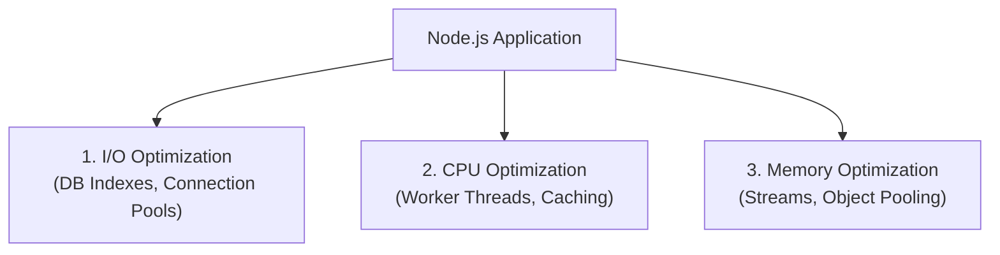

## TL;DR

Optimizing Node.js usually involves offloading work from the single-threaded Event Loop, caching aggressively, and preventing garbage collection pauses by writing memory-efficient code.

## Mental Model



## How It Works (Key Techniques)

1.  **Use Streams**: Never load large files or payloads entirely into memory (e.g., use `createReadStream` instead of `readFile`).
2.  **Avoid Synchronous Functions**: Never use `fs.readFileSync` or `crypto.pbkdf2Sync` in a web server handling requests.
3.  **Caching**: Use Redis or Memcached to store the results of expensive database queries or CPU operations.
4.  **Clustering / Load Balancing**: Run multiple instances of Node.js (via PM2 or Kubernetes) to utilize all CPU cores.
5.  **Gzip / Brotli Compression**: Compress HTTP responses to save network bandwidth.

## Example

```javascript
// BAD: Parsing a massive JSON blocks the event loop
app.get('/data', (req, res) => {
    const data = fs.readFileSync('huge-data.json'); // Blocking I/O
    const json = JSON.parse(data); // Blocking CPU
    res.json(json);
});

// GOOD: Streaming the file directly to the response (fast, zero memory bloat)
app.get('/data', (req, res) => {
    res.setHeader('Content-Type', 'application/json');
    fs.createReadStream('huge-data.json').pipe(res);
});
```

## Common Interview Questions

### Why shouldn't you serve static assets (images, CSS) from Node.js?
Node.js is designed for dynamic, asynchronous logic. Serving static files blocks the event loop with trivial file I/O. It is much more efficient to put a reverse proxy like **NGINX** or a CDN (like Cloudflare) in front of Node.js to serve static assets.

### How does V8 "Hidden Classes" affect performance?
V8 optimizes JavaScript by creating "Hidden Classes" for objects. If you initialize objects with the exact same properties in the exact same order, V8 can optimize access to them. If you dynamically add or delete properties (`delete obj.prop`), V8 has to de-optimize the object, slowing down execution.
