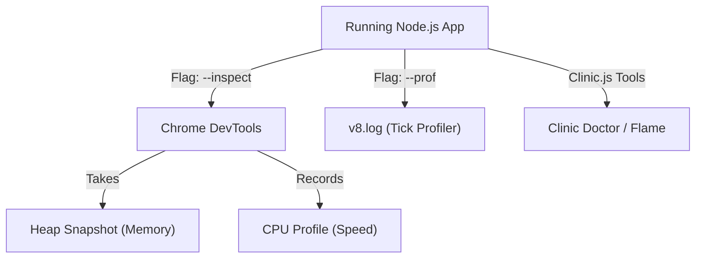

## TL;DR

**Profiling** is the process of analyzing a running Node.js application to measure its memory usage, CPU execution time, and event loop behavior, helping you locate bottlenecks (like memory leaks or synchronous blocking code).

## Mental Model



## How It Works

1.  **CPU Profiling**: Identifies which JavaScript functions are consuming the most CPU time. Usually visualized using a **Flame Graph**.
2.  **Memory Profiling (Heap Snapshots)**: Takes a "picture" of the V8 Heap at a specific moment. By comparing two snapshots taken a few minutes apart, you can see which objects are not being garbage collected (identifying memory leaks).
3.  **Built-in Inspector**: Node.js comes with a built-in debugger. Running `node --inspect index.js` allows you to connect Chrome DevTools directly to your backend Node.js process.

## Example

```bash
# 1. Start your app in inspect mode
node --inspect index.js

# 2. Open Google Chrome and type in the URL bar:
chrome://inspect

# 3. Click "Open dedicated DevTools for Node"
# 4. Go to the "Profiler" tab to record CPU usage.
# 5. Go to the "Memory" tab to take a Heap Snapshot.
```

## Common Interview Questions

### How do you read a Flame Graph?
In a Flame Graph, the x-axis represents the CPU time spent, and the y-axis represents the call stack depth. You look for wide horizontal blocks, which indicate that a specific function took a long time to execute.

### What is Clinic.js?
`Clinic.js` is a popular open-source suite of performance profiling tools for Node.js. It generates highly visual UI dashboards showing CPU usage, memory, event loop delay, and creates flame graphs automatically (e.g., `clinic doctor -- node app.js`).
