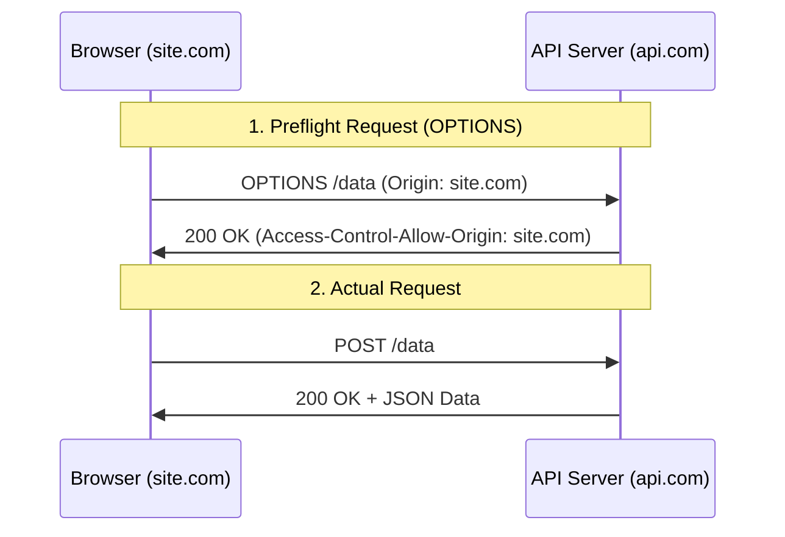

## TL;DR

**CORS (Cross-Origin Resource Sharing)** is a security feature implemented by web browsers. It restricts web pages from making requests to a different domain (origin) than the one that served the web page. Your Node.js backend must explicitly send HTTP headers allowing the browser to read the response.

## Mental Model



## How It Works

If a frontend on `http://localhost:3000` makes an AJAX request to a backend on `http://localhost:8080`, the browser blocks the response unless the backend includes the `Access-Control-Allow-Origin` header.

For "complex" requests (like a `POST` with JSON data or custom headers), the browser will first send an `OPTIONS` request (called a **Preflight**) to ask the server for permission before sending the actual data.

## Example

```javascript
const express = require('express');
const cors = require('cors'); // Use the official cors package
const app = express();

// BAD: Allows ANY domain to access your API (Dangerous for auth APIs)
// app.use(cors()); 

// GOOD: Restrict to specific domains
const corsOptions = {
  origin: ['https://my-frontend.com', 'http://localhost:3000'],
  methods: ['GET', 'POST', 'PUT', 'DELETE'],
  credentials: true // Needed if you want frontend to send cookies!
};

app.use(cors(corsOptions));

app.get('/data', (req, res) => res.json({ secret: 'data' }));
```

## Common Interview Questions

### Who enforces CORS: the backend or the browser?
The **Browser**. The backend still receives the request and might even process it and send a response. The browser is what looks at the response headers and decides to hide the response from the frontend JavaScript if the headers are missing. Tools like Postman or cURL ignore CORS entirely.

### Why do you need `credentials: true`?
If your API relies on Cookies (e.g., for session authentication), the browser will strip the cookies out of cross-origin requests by default. You must configure the frontend to send credentials (`withCredentials: true`), and the backend must explicitly allow it via the `Access-Control-Allow-Credentials: true` header.
