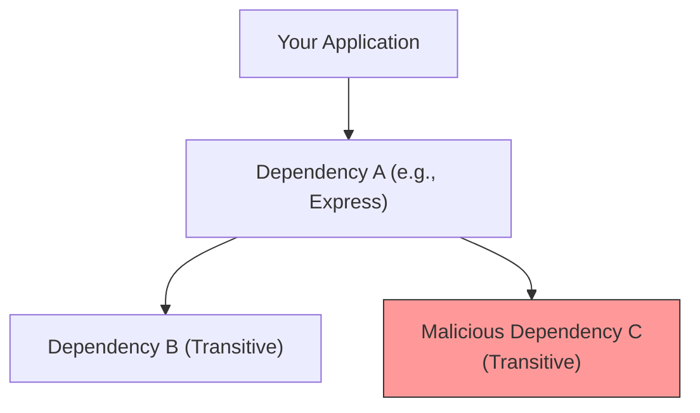

## TL;DR

Modern Node.js applications rely on thousands of third-party dependencies from NPM. **Dependency Security** is the practice of monitoring, updating, and auditing these packages to prevent Supply Chain Attacks, malicious code execution, and vulnerabilities (like ReDoS or Prototype Pollution) from entering your codebase.

## Mental Model



## How It Works

Because dependencies have their own dependencies (transitive dependencies), a single installation can bring in hundreds of unknown packages. Attackers target this by:
1. **Typosquatting**: Publishing a malicious package named `reacct` hoping you misspell `react`.
2. **Account Takeover**: Stealing a popular package maintainer's NPM credentials and publishing a malicious patch update.
3. **Protestware/Sabotage**: Maintainers intentionally breaking their own packages.

## Example (Mitigation)

```bash
# 1. Audit your current dependencies for known CVE vulnerabilities
npm audit

# 2. Fix vulnerabilities by automatically updating safe packages
npm audit fix

# 3. Prevent arbitrary package execution during install
# Some malicious packages run scripts immediately upon installation!
npm install --ignore-scripts
```

## Common Interview Questions

### What does `npm audit` actually do?
It compares the exact versions of the packages in your `package-lock.json` against the GitHub Advisory Database to see if there are any published vulnerabilities (CVEs).

### What is a "Supply Chain Attack"?
It's an attack where instead of hacking your servers directly, the attacker compromises a third-party tool, library, or dependency you rely on. When your CI/CD pipeline builds the app, it automatically pulls in the compromised code, giving the attacker access to your system.
