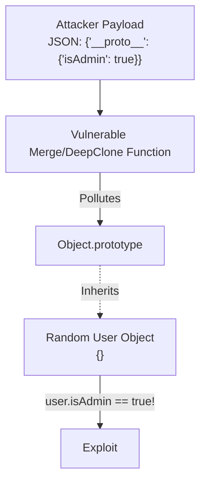

## TL;DR

**Prototype Pollution** occurs when an attacker can inject properties into the base `Object.prototype`. Because almost all objects in JavaScript inherit from this prototype, the injected properties magically appear on all existing and newly created objects in the application, leading to logic bypasses, crashes, or Remote Code Execution (RCE).

## Mental Model



## How It Works

It typically happens in functions that recursively merge objects, deep clone objects, or parse complex query strings. If a function doesn't sanitize the keys `__proto__`, `constructor`, or `prototype`, an attacker can modify the global prototype chain.

## Example

```javascript
// A poorly written, vulnerable deep merge function
function merge(target, source) {
    for (let key in source) {
        if (typeof source[key] === 'object') {
            if (!target[key]) target[key] = {};
            merge(target[key], source[key]); // Recursive merge
        } else {
            target[key] = source[key];
        }
    }
}

// 1. We have an innocent empty object
const myAppConfig = {}; 
console.log(myAppConfig.isAdmin); // undefined

// 2. Attacker sends a malicious JSON payload
const maliciousPayload = JSON.parse('{"__proto__": {"isAdmin": true}}');

// 3. Application merges the payload
merge({}, maliciousPayload);

// 4. THE EXPLOIT: All objects now have isAdmin = true!
console.log(myAppConfig.isAdmin); // true!
```

## Common Interview Questions

### How do you prevent Prototype Pollution?
1. **Object.create(null)**: Create objects that do not inherit from `Object.prototype`.
2. **Input Validation/Sanitization**: Never allow `__proto__`, `constructor`, or `prototype` keys in user input before merging or cloning.
3. **Use Map**: If you are storing key-value pairs where keys are user-provided, use a `Map` instead of a plain Object.
4. **Freeze the Prototype**: Call `Object.freeze(Object.prototype)` at the start of your application (though this might break older, poorly written NPM packages).
