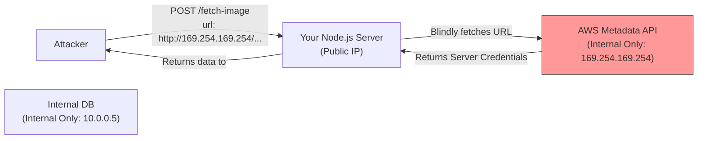

## TL;DR

**Server-Side Request Forgery (SSRF)** is a vulnerability where an attacker tricks your Node.js backend into making an HTTP request to an internal or arbitrary external system on their behalf. This can be used to bypass firewalls, access internal metadata APIs, or perform port scanning.

## Mental Model



## How It Works

Many applications have features that fetch data from a URL provided by the user (e.g., fetching a profile picture from a URL, webhooks, PDF generators). If the server blindly passes the user's URL into `fetch()` or `axios.get()`, the attacker can supply internal IPs (like `localhost`, `127.0.0.1`, or cloud metadata IPs).

## Example

```javascript
const express = require('express');
const axios = require('axios');
const app = express();
app.use(express.json());

// VULNERABLE ROUTE
app.post('/proxy-image', async (req, res) => {
    const { url } = req.body;
    
    try {
        // Attackers can pass url: "http://localhost:6379" (Redis)
        // or url: "http://169.254.169.254/latest/meta-data/iam/security-credentials/" (AWS)
        const response = await axios.get(url);
        res.send(response.data);
    } catch (err) {
        res.status(500).send('Error fetching image');
    }
});
```

## Common Interview Questions

### How do you mitigate SSRF in Node.js?
1. **Allow-listing**: Only allow requests to specific, trusted domains.
2. **Deny-listing IPs**: Resolve the domain to an IP address *before* making the request, and block private IP ranges (e.g., `127.0.0.0/8`, `10.0.0.0/8`, `169.254.169.254`).
3. **Network Isolation**: Run the microservice that fetches external URLs in an isolated network (VPC/Subnet) that has strictly zero access to internal databases or metadata services.

### Why is denying `localhost` not enough?
Because attackers can use DNS tricks. They can set up a custom domain (`evil.com`) whose DNS A-record points to `127.0.0.1`. The application checks the string, sees it doesn't say "localhost", but the underlying HTTP client resolves it to the internal network. You must validate the resolved IP.
