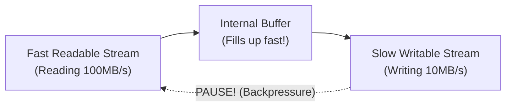

## TL;DR

**Backpressure** occurs when a Readable stream reads data faster than a Writable stream can consume and process it. If left unmanaged, the data will accumulate in memory, eventually causing an Out of Memory (OOM) crash.

## Mental Model



## How It Works

Every stream has an internal buffer with a size limit (the `highWaterMark`, usually 16kb or 64kb). 
When you write to a stream `stream.write(chunk)`, it returns `true` if the buffer has space, and `false` if the buffer is full.
If it returns `false`, you must **stop reading** (apply backpressure) until the Writable stream emits the `'drain'` event, signaling that its buffer is empty and you can resume writing.

## Example

```javascript
// Manual backpressure handling (what .pipe() does for you under the hood)
readStream.on('data', (chunk) => {
    // Write chunk. If it returns false, the buffer is full!
    const canContinue = writeStream.write(chunk);
    
    if (!canContinue) {
        console.log('Backpressure! Pausing read stream.');
        readStream.pause(); // Apply backpressure
    }
});

// Once the writeStream drains its buffer, resume reading
writeStream.on('drain', () => {
    console.log('Buffer drained. Resuming read stream.');
    readStream.resume();
});
```

## Common Interview Questions

### How does `.pipe()` handle backpressure?
The `.pipe()` function automatically handles backpressure. It listens for the `false` return from `.write()` and automatically pauses the source stream, then listens for the `'drain'` event to resume it.

### What is the `highWaterMark`?
It is the threshold (in bytes) that specifies the maximum amount of data a stream will store in its internal buffer before asking you to pause reading. It is a configuration option, not a strict memory limit.
