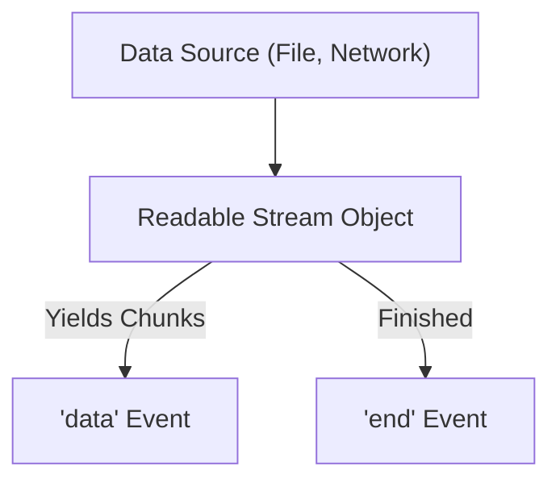

## TL;DR

A **Readable stream** represents a source from which data is consumed. It emits data in chunks rather than serving the whole payload at once.

## Mental Model



## How It Works

A Readable stream can operate in two modes:
1.  **Flowing Mode**: Data is read from the underlying system automatically and provided to an application as quickly as possible via `'data'` events.
2.  **Paused Mode**: You must explicitly call `stream.read()` to get chunks of data out.

By default, all Readable streams start in paused mode. Attaching a `'data'` event listener or using `.pipe()` switches them to flowing mode.

## Example

```javascript
const fs = require('fs');
const readable = fs.createReadStream('large-file.txt', { encoding: 'utf8' });

// Attaching the 'data' listener switches it to flowing mode
readable.on('data', (chunk) => {
    console.log(`Received ${chunk.length} bytes of data.`);
});

readable.on('end', () => {
    console.log('Finished reading file.');
});
```

## Common Interview Questions

### What happens when you call `stream.pause()`?
Calling `stream.pause()` stops the stream from emitting `'data'` events, switching it from flowing mode back to paused mode. Data may still be buffered internally up to the `highWaterMark`.

### Can you implement a custom Readable stream?
Yes, by importing `Readable` from `node:stream` and creating a class that extends it. You must implement the `_read(size)` method, where you push data using `this.push(data)`. When done, push `null`.
