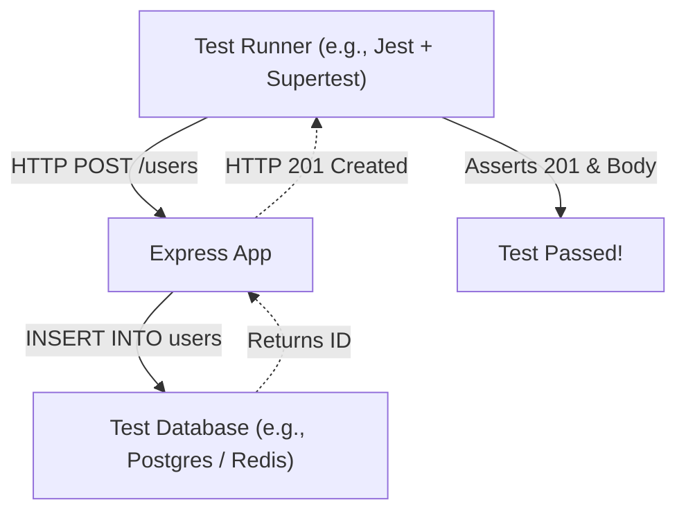

## TL;DR

**Integration Testing** verifies that multiple modules or services work correctly when combined. In Node.js backend development, this typically means testing your API endpoints (Express routes) along with the real database to ensure data flows correctly from the HTTP request down to the persistence layer.

## Mental Model



## How It Works

Instead of testing a single function, you test an entire "slice" of the architecture.
To do this effectively in Node.js:
1. You use a library like **Supertest** to simulate HTTP requests without actually binding the server to a network port.
2. You spin up an ephemeral test database (using Docker, or an in-memory DB like `mongodb-memory-server`).
3. You seed the database before the test, run the HTTP request, and verify both the HTTP response and the resulting state in the database.

## Example

```javascript
// Using Jest and Supertest
const request = require('supertest');
const app = require('./app'); // Your Express app (not yet listening on a port)
const db = require('./db');

beforeAll(async () => {
    await db.connectToTestDatabase();
});

afterAll(async () => {
    await db.clearAndDisconnect(); // Important! Clean up so tests don't hang
});

describe('POST /api/users', () => {
    it('should create a new user and return 201', async () => {
        const payload = { username: 'alice', password: 'secure123' };

        const response = await request(app)
            .post('/api/users')
            .send(payload);

        // 1. Assert HTTP level
        expect(response.status).toBe(201);
        expect(response.body).toHaveProperty('id');

        // 2. Assert Database level
        const userInDb = await db.findUserByUsername('alice');
        expect(userInDb).not.toBeNull();
    });
});
```

## Common Interview Questions

### Why do we need Integration tests if we have 100% Unit test coverage?
Unit tests mock out dependencies. Two functions might pass their unit tests perfectly, but fail when integrated because one function expects a specific JSON format that the other function doesn't actually provide. Integration tests catch these "glue" bugs.

### How do you handle databases in integration tests?
Never use your production or development database. Ideally, use a CI/CD pipeline to spin up a fresh, empty database container (Docker), run migrations, seed necessary test data, run the tests, and tear the container down.
