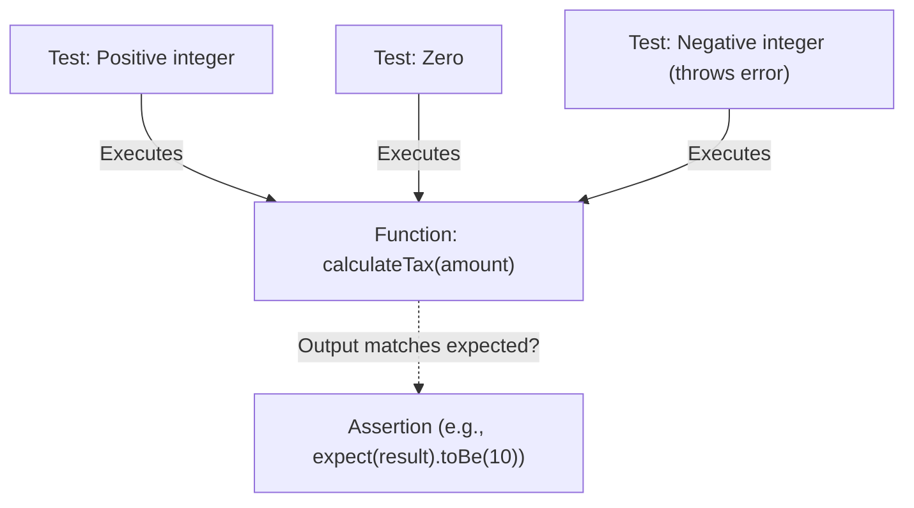

## TL;DR

**Unit Testing** involves testing the smallest pieces of your code (usually individual functions or classes) in complete isolation from the rest of the application and external dependencies (like databases or networks). 

## Mental Model



## How It Works

A good unit test follows the **AAA** pattern:
1.  **Arrange**: Set up the inputs and initial state.
2.  **Act**: Call the function being tested.
3.  **Assert**: Verify that the output matches the expected result.

Frameworks like **Jest**, **Mocha**, or the native Node.js **`node:test`** module provide the test runner and assertion libraries.

## Example

```javascript
// math.js
function add(a, b) {
    if (typeof a !== 'number' || typeof b !== 'number') {
        throw new Error('Inputs must be numbers');
    }
    return a + b;
}
module.exports = { add };

// math.test.js (Using Jest)
const { add } = require('./math');

describe('add() function', () => {
    it('should correctly add two positive numbers', () => {
        // Arrange
        const a = 5, b = 10;
        // Act
        const result = add(a, b);
        // Assert
        expect(result).toBe(15);
    });

    it('should throw an error if input is a string', () => {
        // Asserting errors requires wrapping the act in a callback
        expect(() => add(5, "10")).toThrow('Inputs must be numbers');
    });
});
```

## Common Interview Questions

### Should a Unit Test connect to a database?
**No.** If a test connects to a database, reads a file, or makes an HTTP request, it is an *Integration Test*, not a Unit Test. Unit tests must be completely deterministic and run in milliseconds.

### What is Code Coverage?
Code Coverage is a metric that shows what percentage of your source code lines were executed during the unit tests. While 100% coverage is nice, it does not guarantee your code is bug-free (it only means every line ran, not that every logical edge case was asserted).
