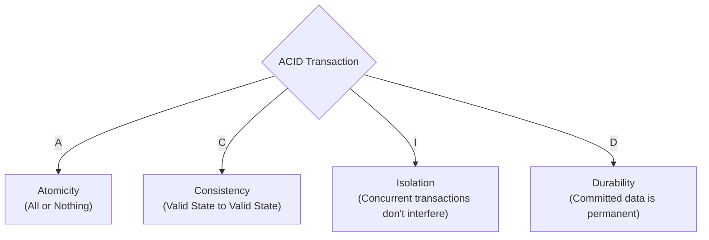

## TL;DR

ACID is a set of properties that guarantee database transactions are processed reliably, even in the event of errors, power failures, or concurrent access. 

## Mental Model

## The Four Pillars

### 1. Atomicity (All or Nothing)
A transaction is treated as a single, indivisible unit. If any part of the transaction fails, the *entire* transaction is rolled back, leaving the database completely unchanged. 
*(e.g., If you transfer $100 from A to B, the DB must not deduct $100 from A and crash before adding it to B).*

### 2. Consistency
The database must always remain in a structurally sound state. A transaction can only bring the database from one valid state to another valid state, strictly enforcing all constraints, cascades, and triggers.
*(e.g., If column `age` has a `CHECK (age > 0)` constraint, a transaction cannot commit a negative age).*

### 3. Isolation
Concurrent execution of transactions leaves the database in the same state that would have been obtained if the transactions were executed sequentially.
*(e.g., User A and User B both try to buy the last concert ticket at the exact same millisecond. Isolation ensures only one succeeds).*

### 4. Durability
Once a transaction has been committed, it will remain committed even in the case of a system failure (e.g., power outage or crash). The database guarantees this by writing transaction logs to non-volatile storage (disk) before acknowledging the commit.

## Interview Questions

### How does a database achieve Durability if it caches data in RAM for speed?
Through a **Write-Ahead Log (WAL)**. Before modifying the actual data pages in RAM, the database appends a log of the intended changes to a strictly sequential file on the hard drive. If the power cuts out, upon reboot, the database replays the WAL to restore the committed data.

### Is NoSQL ACID compliant?
Historically, no. Most NoSQL databases (like MongoDB or Cassandra) prioritize Availability and Partition Tolerance (AP in the CAP theorem) over strict Consistency, dropping ACID guarantees in favor of **BASE** (Basically Available, Soft state, Eventual consistency). However, modern versions of MongoDB and DynamoDB now support multi-document ACID transactions.

## Remember

> ACID ensures your bank account doesn't magically lose money when the database server loses power.
