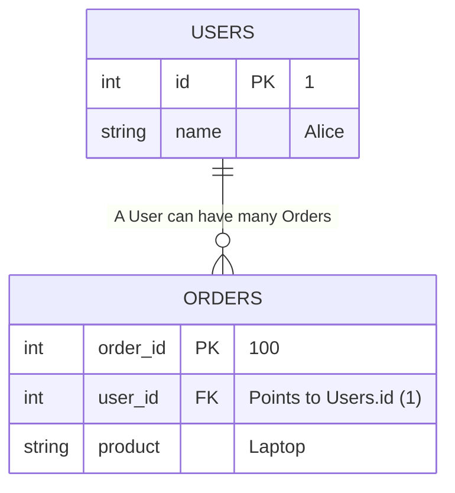

## Concept

Relational Databases are powerful because they don't store all data in one giant, messy spreadsheet. They split data into separate tables (Normalization) and link them together.
A **Foreign Key (FK)** is a column in one table that points to the **Primary Key** of another table. It acts as the bridge connecting two tables.

More importantly, a Foreign Key enforces **Referential Integrity**. The database will mathematically forbid you from entering a Foreign Key value if that value doesn't actually exist in the parent table.

## Mental Model



## How It Works

Let's create two tables: `users` and `orders`. We want to track which user bought which order.

```sql
-- 1. Create the Parent Table
CREATE TABLE users (
    id SERIAL PRIMARY KEY,
    name VARCHAR(100)
);

-- 2. Create the Child Table with a Foreign Key
CREATE TABLE orders (
    order_id SERIAL PRIMARY KEY,
    product_name VARCHAR(100),
    user_id INT,
    
    -- This constraint explicitly links the two tables
    CONSTRAINT fk_user 
      FOREIGN KEY (user_id) 
      REFERENCES users(id)
);
```

### Referential Integrity in Action

If we insert Alice as `User ID 1`:
- `INSERT INTO orders (product_name, user_id) VALUES ('Laptop', 1);` -> **SUCCESS**. (User 1 exists).
- `INSERT INTO orders (product_name, user_id) VALUES ('Mouse', 999);` -> **CRASH**. (User 999 does not exist. The Foreign Key rejects the insert, preventing orphaned data).

## ON DELETE Cascades

What happens if Alice deletes her account, but she still has 5 orders sitting in the `orders` table? The `orders` table now has `user_id = 1`, which no longer exists. This violates referential integrity!
By default, the database will **prevent you from deleting Alice** and throw an error.

To solve this, you configure the Foreign Key with an `ON DELETE` rule:

1. **`ON DELETE CASCADE`:** If Alice is deleted, the database silently and automatically deletes all 5 of her orders too. (Dangerous but clean).
2. **`ON DELETE SET NULL`:** If Alice is deleted, the database keeps the orders, but changes their `user_id` to `NULL`. (Good for retaining financial records).
3. **`ON DELETE RESTRICT` (Default):** Throws an error. You must manually delete her orders first before the database allows you to delete Alice.

```sql
CREATE TABLE orders (
    -- ...
    user_id INT REFERENCES users(id) ON DELETE CASCADE
);
```

## Trade-Offs

- **Pros:** 
  - **Guaranteed Consistency:** You can never have "orphaned" orders belonging to non-existent users. The database physically prevents bad code from corrupting the relationships.
- **Cons:** 
  - **Performance Hit:** Every time you insert an Order, the database must pause, jump to the `users` table, and verify the ID exists before saving the order. In massive, high-write applications (like logging or telemetry), developers intentionally *do not* use Foreign Keys to save CPU cycles.
  - **Sharding Nightmare:** Foreign Keys do not work across different physical databases. If you shard your database (Users on Server A, Orders on Server B), you must completely drop your Foreign Keys and enforce the integrity manually in your Node.js code.

## Interview Questions

**Q: A developer runs `DELETE FROM users WHERE id = 1`, and the database hangs for 5 minutes before finally succeeding. The `orders` table has an `ON DELETE CASCADE` rule and 10 million rows. Why did it take so long, and how do you fix it?**
**A:** When `ON DELETE CASCADE` triggers, the database must scan the `orders` table to find all rows where `user_id = 1` to delete them. 
By default, the database **does not** automatically create an index on Foreign Key columns! Therefore, the database was forced to perform a Full Table Scan of 10 million orders just to find Alice's 5 orders.
**Fix:** You must *always* manually create an index on your Foreign Key columns. `CREATE INDEX idx_orders_user_id ON orders(user_id);`. This will reduce the deletion time from 5 minutes to 2 milliseconds.

**Q: Can a Foreign Key point to a column that is NOT a Primary Key?**
**A:** Yes, but with a strict condition. A Foreign Key can point to *any* column in the parent table, as long as that column has a `UNIQUE` constraint. It must be mathematically impossible for the Foreign Key to point to an ambiguous target.
