## Concept

If you have a `users` table, there might be 50 people named "John Smith". If you want to update the password for one specific John Smith, you cannot write `UPDATE users ... WHERE name = 'John Smith'`, or you will change the password for all 50 people.

A **Primary Key (PK)** is a specific column (or combination of columns) that uniquely identifies every single row in a table. 
By definition, a Primary Key must possess two absolute properties:
1. **UNIQUE:** No two rows can have the same Primary Key value.
2. **NOT NULL:** A Primary Key cannot be empty (`NULL`).

## Mental Model

```mermaid
flowchart TD
    subgraph Users Table
        direction LR
        Row1["ID: 1\nName: John Smith\n(Valid)"]
        Row2["ID: 2\nName: John Smith\n(Valid)"]
        Row3["ID: 1\nName: Alice\n(CRASH! ID 1 exists)"]
        Row4["ID: NULL\nName: Bob\n(CRASH! Cannot be NULL)"]
        
        style Row1 fill:#2d3748,stroke:#48bb78
        style Row2 fill:#2d3748,stroke:#48bb78
        style Row3 fill:#2d3748,stroke:#f56565
        style Row4 fill:#2d3748,stroke:#f56565
    end
```



## How It Works

You define the Primary Key when creating the table. The database will automatically build a **B-Tree Index** on this column, making lookups incredibly fast ($O(\log N)$).

### 1. Natural vs Surrogate Keys
- **Natural Key:** Using real-world data as the primary key (e.g., Social Security Number, Email Address). *This is generally discouraged because real-world data changes (users change emails).*
- **Surrogate Key:** An artificially generated column specifically created just to be the primary key (e.g., an Auto-Incrementing Integer or a UUID). *This is the industry standard.*

```sql
-- Using an Auto-Incrementing Surrogate Key (PostgreSQL)
CREATE TABLE users (
    id SERIAL PRIMARY KEY,
    email VARCHAR(255) UNIQUE NOT NULL,
    name VARCHAR(100)
);
```

### 2. Composite Primary Keys
Sometimes, a single column isn't enough. You can combine two columns to create a single Primary Key.
For example, in a `course_enrollments` table, a student can enroll in multiple courses, and a course has multiple students. Neither `student_id` nor `course_id` are unique on their own. But the *combination* of `(student_id, course_id)` must be unique (a student cannot enroll in the exact same course twice).

```sql
CREATE TABLE enrollments (
    student_id INT,
    course_id INT,
    enrollment_date DATE,
    PRIMARY KEY (student_id, course_id)
);
```

## Trade-Offs: Auto-Incrementing Integers vs UUIDs

When choosing a Surrogate Key, developers debate between Integers (1, 2, 3...) and UUIDs (`550e8400-e29b...`).

- **Auto-Increment Integer (`SERIAL`):**
  - *Pros:* Incredibly fast to index. Takes very little disk space (4 bytes). Easy for humans to read.
  - *Cons:* Extremely dangerous for security (Insecure Direct Object Reference). If a user goes to `api.com/receipt/105`, they can simply guess that `api.com/receipt/106` belongs to someone else and try to steal it. Also, terrible for distributed databases because multiple servers will try to generate the number `1` simultaneously.
- **UUID (Universally Unique Identifier):**
  - *Pros:* Mathematically guaranteed to be unique globally. Excellent for distributed databases. Un-guessable for security.
  - *Cons:* Slow to index. Takes massive disk space (16-36 bytes). Terrible for database performance if randomly generated (B-Tree fragmentation).

## Interview Questions

**Q: Can a table have more than one Primary Key?**
**A:** No. A table can only have **one** Primary Key. However, that single Primary Key can be composed of multiple columns (a Composite Primary Key). If you need to enforce uniqueness on other columns (like `email` and `username`), you apply a `UNIQUE` constraint to them, but they are not the Primary Key.

**Q: Why do UUID v4 (random UUIDs) completely destroy database insert performance in heavy-write applications?**
**A:** A Relational Database stores the Primary Key in a B-Tree Index, which is physically sorted on the hard drive. 
When you insert sequential integers (1, 2, 3...), the database easily appends them to the end of the physical file. 
UUID v4 is completely random. To insert a random string into a sorted B-Tree, the database must constantly split physical pages on the hard drive to make room in the middle of the tree. This causes massive Disk I/O, fragmentation, and grinds write performance to a halt. To fix this, modern systems use **Sequential UUIDs (UUID v7 or ULID)**, which embed a timestamp at the beginning of the string so they naturally sort chronologically.
