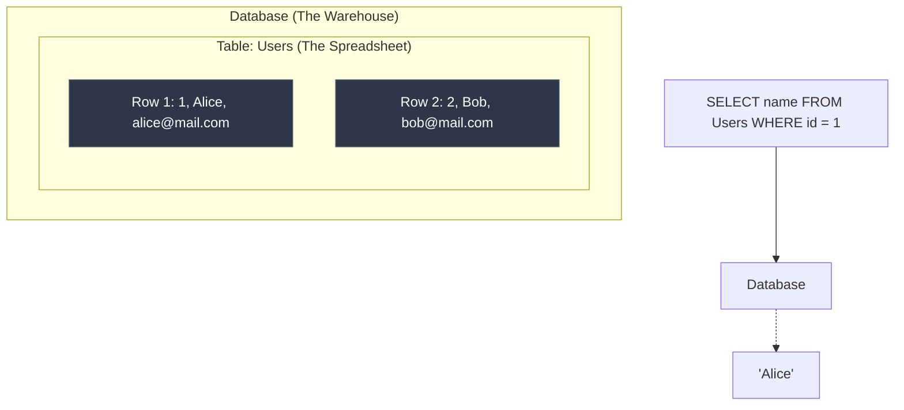

## Concept

**SQL (Structured Query Language)** is the standard language for communicating with Relational Database Management Systems (RDBMS) like PostgreSQL, MySQL, SQL Server, and Oracle. 
A relational database organizes data into **Tables** (like spreadsheets), which consist of **Rows** (individual records) and **Columns** (attributes).

Unlike programming languages like Javascript (which are imperative—you tell the computer *how* to do it), SQL is a **Declarative** language. You tell the database *what* data you want, and the database's internal Query Optimizer decides the fastest way to fetch it.

## Mental Model



## How It Works: The Basic Syntax

Every SQL query follows a strictly enforced logical order of execution, even if you write the keywords in a different order.

```sql
-- 1. SELECT: Which columns do you want to see?
SELECT first_name, last_name 

-- 2. FROM: Which table holds the data?
FROM employees 

-- 3. WHERE: How should we filter the rows? (Optional)
WHERE department = 'Engineering' 

-- 4. ORDER BY: How should the results be sorted? (Optional)
ORDER BY last_name ASC;
```

## Trade-Offs

- **Pros:** 
  - Standardized across the industry. If you know PostgreSQL, you can easily read MySQL or Oracle.
  - Incredibly powerful. You can perform complex math, data aggregations, and filtering using just a few lines of code, rather than writing a 50-line `for` loop in Node.js.
  - Strict Data Integrity. SQL enforces rules (Data Types, Constraints) to ensure bad data never enters the system.
- **Cons:** 
  - Scaling relational databases horizontally (across multiple servers) is notoriously difficult.
  - Schema changes (adding a column to a table with 1 billion rows) can lock the database and cause downtime.

## Real-World Usage

- **PostgreSQL:** Currently the most popular, feature-rich, and advanced open-source relational database. It is the default choice for modern web applications.
- **MySQL:** Heavily used by older PHP applications (WordPress) and massive tech companies (Uber, Twitter) that have customized its storage engines.
- **SQLite:** A tiny, serverless SQL database that stores the entire database in a single `.sqlite` file on your hard drive. Every iPhone and Android phone heavily uses SQLite internally to store app data.

## Interview Questions

**Q: You write a query: `SELECT name FROM users WHERE age > 25 ORDER BY name`. In what exact order does the database execute these three clauses?**
**A:** The database executes them in this order:
1. `FROM users` (It must first locate the table and load the data).
2. `WHERE age > 25` (It filters the rows).
3. `SELECT name` (It extracts only the requested columns from the filtered rows).
4. `ORDER BY name` (It sorts the final output).
Understanding this execution order is critical. For example, you cannot use a column alias defined in the `SELECT` clause inside the `WHERE` clause, because the `WHERE` clause is executed *before* the `SELECT` clause even creates the alias.

**Q: What is the difference between SQL and NoSQL?**
**A:** 
- **SQL (Relational):** Data is strictly structured in Tables with predefined Schemas. Data is normalized (split across multiple tables) and queried using `JOIN`s. Excellent for financial data requiring ACID compliance.
- **NoSQL (Non-Relational):** Data is unstructured (often JSON documents). Schemas are dynamic (you can add a new field to a document without altering a table). Data is usually denormalized (nested). Excellent for rapidly changing data models and massive horizontal scaling.
