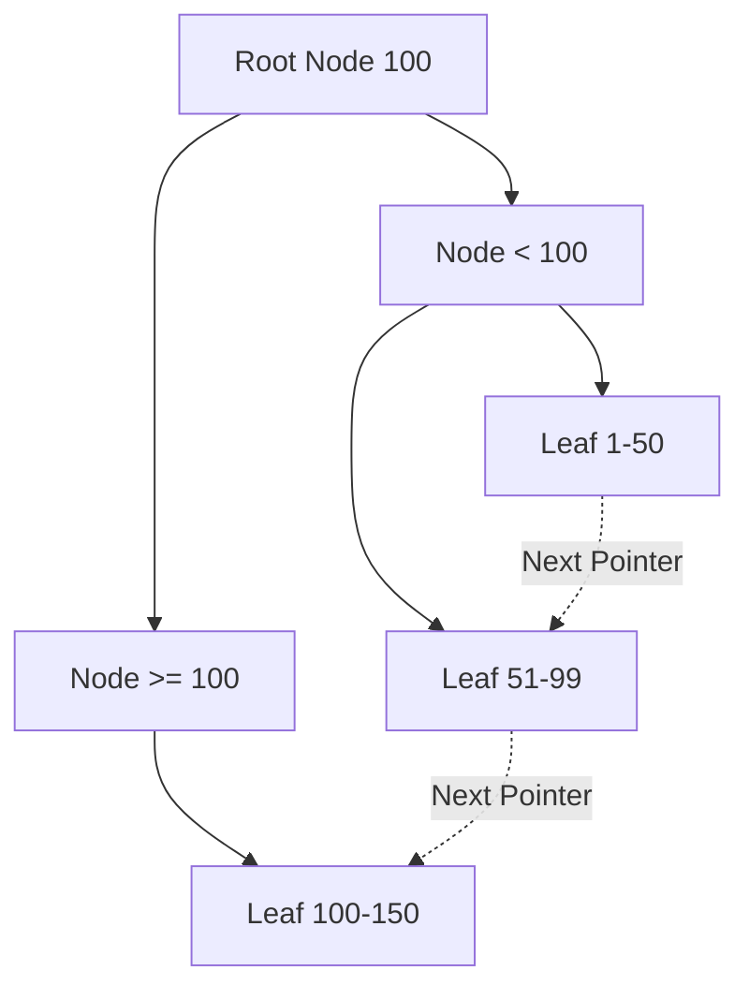

## TL;DR

An index is a separate data structure (usually a B-Tree) that speeds up data retrieval operations on a database table at the cost of additional writes and storage space.

## Mental Model


*A B+Tree keeps all data at the leaf nodes, connected by a linked list for fast range queries.*

## Example

```sql
-- Searching without an index (Sequential Scan - O(N))
SELECT * FROM users WHERE email = 'alice@example.com';

-- Creating an index
CREATE INDEX idx_users_email ON users(email);

-- Searching with an index (Index Scan - O(log N))
SELECT * FROM users WHERE email = 'alice@example.com';
```

## How It Works

1.  **B-Tree / B+Tree**: Most relational databases use B+Trees. When you index a column (like `email`), the DB creates a sorted tree of all emails.
2.  **Lookups**: Searching the tree takes $O(\log N)$ time, significantly faster than scanning every row $O(N)$.
3.  **Leaf Nodes**: 
    *   In a **Clustered Index** (usually the Primary Key), the leaf nodes contain the actual row data.
    *   In a **Non-Clustered Index**, the leaf nodes contain a pointer to the actual row data (requiring a secondary lookup).

## Interview Questions

### Why not index every column?
1.  **Storage**: Indexes take up disk space and memory.
2.  **Write Penalty**: Every `INSERT`, `UPDATE`, or `DELETE` requires the database to also update the B-Tree index, slowing down write operations.

### What is a Covering Index?
An index that contains *all* the columns needed for a specific query. Because all data is present in the index itself, the database doesn't need to perform the secondary lookup to the actual table row.
```sql
CREATE INDEX idx_users_email_name ON users(email, name);
-- This query is fully "covered" by the index
SELECT name FROM users WHERE email = 'alice@example.com'; 
```

### What is a Composite Index and does order matter?
A composite index covers multiple columns (e.g., `(last_name, first_name)`).
**Order absolutely matters.** It follows the "Leftmost Prefix Rule." The database can only use the index if your `WHERE` clause uses the first column (`last_name`). If you search only by `first_name`, the index is useless.

## Common Gotchas

*   **Functions disable indexes**: `WHERE LOWER(email) = 'foo@bar.com'` will NOT use the `email` index. You must create a functional/expression index instead (`CREATE INDEX ON users(LOWER(email))`).
*   **Wildcards**: `WHERE email LIKE '%@gmail.com'` (leading wildcard) cannot use a B-Tree index. 

## Remember

> Indexes speed up **Reads** but slow down **Writes**. Optimize for your query patterns.
