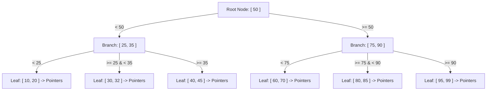

## Concept

When you type `CREATE INDEX idx_age ON users(age)`, what does the database physically construct on the hard drive?
By default, 99% of relational databases build a **B-Tree** (Balanced Tree). 

A B-Tree is a self-balancing search tree. Unlike a simple Binary Tree (where a node can only have 2 children), a node in a B-Tree can contain dozens or hundreds of values, and have hundreds of children. This makes the tree extremely "shallow" and wide, which is critical for minimizing the physical spinning of a mechanical hard drive.

## Mental Model

## How It Works: Searching

If you run `SELECT * FROM users WHERE age = 30`:
1. The database loads the **Root Node** into RAM. Is 30 less than 50? Yes. Go down the Left path.
2. The database loads **Branch 1**. Is 30 between 25 and 35? Yes. Go down the Middle path.
3. The database loads **Leaf 2**. It finds 30. Attached to 30 is a physical pointer (e.g., `Disk Sector 500, Row 2`).
4. The database jumps directly to the hard drive, bypassing 9.99 million irrelevant rows, and grabs the exact row in 3 Disk I/O operations. This is $O(\log N)$.

## How It Works: Range Queries

Why don't databases use Hash Tables for indexes? A Hash Table (`{30: pointer}`) is $O(1)$ lookup time, which is mathematically faster than a B-Tree!
Because Hash Tables destroy sorting. 
If you write `WHERE age > 30 AND age < 40`, a Hash Table is useless because hashes are randomized.
A B-Tree is brilliant because **all the Leaf Nodes are physically linked together in a doubly-linked list on the hard drive.**
To find everyone between 30 and 40, the database navigates down to `30`. Then, instead of navigating the tree again, it just walks sideways across the linked leaf nodes (`30 -> 32 -> 40`), slurping up the data instantly.

## Trade-Offs: B-Tree Fragmentation (Page Splits)

A physical page on a hard drive is exactly 8 Kilobytes. A B-Tree node is perfectly sized to fit into exactly one 8KB page.
If Leaf 2 `[30, 32]` is completely full, and you execute `INSERT INTO users (age) VALUES (31)`, the database has a crisis.
It cannot fit `31` into the 8KB physical block. It must perform a **Page Split**. 
It creates a brand new 8KB block on the hard drive, rips half the data out of Leaf 2, moves it to the new block, and updates the parent Branch pointers. This causes massive Disk I/O, stalls concurrent queries, and fragments the hard drive.
This is why inserting random data into a B-Tree index is highly discouraged.

## Interview Questions

**Q: Explain why you should never use a randomized UUID v4 as a Primary Key in MySQL/InnoDB.**
**A:** MySQL's InnoDB engine stores the Primary Key as a **Clustered B-Tree Index**. This means the physical row data is actually stored *inside* the leaf nodes of the B-Tree, physically ordered by the Primary Key on the hard drive.
When you use a randomized UUID v4, every `INSERT` statement generates a completely random string (e.g., `A...`, then `Z...`, then `B...`). The database is forced to insert these rows completely out of order. This triggers catastrophic, continuous **Page Splits**, shredding the B-Tree and causing your hard drive to thrash violently, grinding write performance to a halt. You must use sequential auto-incrementing integers, or sequential UUIDs (UUID v7), so the database can safely append new rows to the far-right edge of the B-Tree without splitting existing pages.
