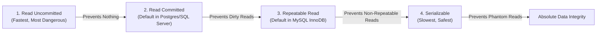

## TL;DR

Isolation Levels define how strict a database is about keeping concurrent transactions hidden from one another. Higher isolation prevents data anomalies but drastically reduces concurrency/performance due to locking.

## The Concurrency Problems (Anomalies)

1. **Dirty Read**: Reading uncommitted data from another transaction. (If they roll back, you read data that never truly existed).
2. **Non-Repeatable Read**: Reading the same row twice in a transaction and getting different values because another transaction *updated* it in between.
3. **Phantom Read**: Running the same `SELECT ... WHERE` query twice and getting a different number of rows because another transaction *inserted/deleted* matching rows in between.

## The 4 Isolation Levels

### 1. Read Uncommitted
Transactions can read data that other transactions haven't committed yet.
- **Vulnerabilities**: Dirty Reads, Non-Repeatable Reads, Phantom Reads.
- **Use case**: Almost never used. 

### 2. Read Committed
A transaction can only read data that has been fully committed.
- **Vulnerabilities**: Non-Repeatable Reads, Phantom Reads.
- **Use case**: The default in PostgreSQL and SQL Server. Good balance of speed and safety.

### 3. Repeatable Read
If you read a row, the database guarantees that if you read it again later in the same transaction, the value will not have changed (other transactions are blocked from updating your read rows).
- **Vulnerabilities**: Phantom Reads (Other transactions can still INSERT *new* rows that match your query).
- **Use case**: Default in MySQL. Useful for financial calculations.

### 4. Serializable
The strictest level. Transactions are executed in a way that makes it appear as if they were executed sequentially, one after the other. 
- **Vulnerabilities**: None.
- **Use case**: When absolute correctness is required at the heavy cost of lock contention and performance.

## Interview Questions

### How do databases implement Isolation Levels without locking the entire table?
Through **MVCC (Multi-Version Concurrency Control)**. Instead of locking a row when someone reads it, the database keeps multiple versions of the row. A reader simply reads a "snapshot" of the row from the past, while a writer can safely update the newest version.

## Remember

> There is no free lunch. Higher isolation = fewer bugs, but more deadlocks and worse performance. Lower isolation = blazing fast, but you might read garbage data.
