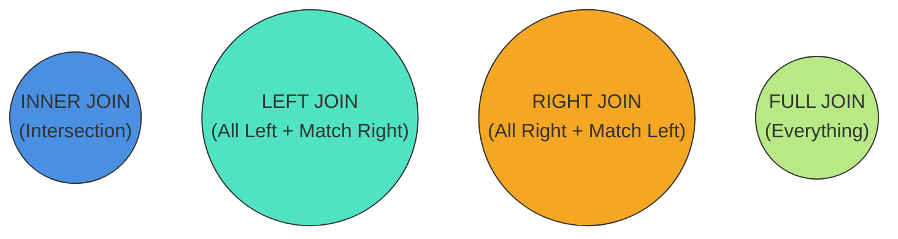

## TL;DR

A `JOIN` clause is used to combine rows from two or more tables based on a related column between them. 

## Mental Model



## Example Data

**Users** (Left)
| id | name |
|----|------|
| 1  | Alice|
| 2  | Bob  |
| 3  | Eve  |

**Orders** (Right)
| id | user_id | amount |
|----|---------|--------|
| 1  | 1       | $10    |
| 2  | 2       | $20    |
| 3  | 99      | $50    |

## Types of Joins

### 1. INNER JOIN
Returns records that have matching values in **both** tables.
```sql
SELECT Users.name, Orders.amount
FROM Users
INNER JOIN Orders ON Users.id = Orders.user_id;
-- Result: Alice ($10), Bob ($20)
-- Eve and Order 99 are dropped.
```

### 2. LEFT JOIN (Left Outer Join)
Returns all records from the **left** table, and matched records from the right. Unmatched right sides are NULL.
```sql
SELECT Users.name, Orders.amount
FROM Users
LEFT JOIN Orders ON Users.id = Orders.user_id;
-- Result: Alice ($10), Bob ($20), Eve (NULL)
```

### 3. RIGHT JOIN (Right Outer Join)
Returns all records from the **right** table, and matched records from the left. Unmatched left sides are NULL.
```sql
SELECT Users.name, Orders.amount
FROM Users
RIGHT JOIN Orders ON Users.id = Orders.user_id;
-- Result: Alice ($10), Bob ($20), NULL ($50)
```

### 4. FULL JOIN (Full Outer Join)
Returns all records when there is a match in **either** left or right table.
```sql
SELECT Users.name, Orders.amount
FROM Users
FULL OUTER JOIN Orders ON Users.id = Orders.user_id;
-- Result: Alice ($10), Bob ($20), Eve (NULL), NULL ($50)
```

## Interview Questions

### What is a CROSS JOIN?
A Cartesian product. It joins every row of the left table with every row of the right table. If Table A has 10 rows and Table B has 10 rows, the result has 100 rows.
`SELECT * FROM Users CROSS JOIN Orders;`

### How do you perform a SELF JOIN?
By joining a table to itself using aliases. This is useful for hierarchical data (e.g., finding an employee's manager in the same `Employees` table).
```sql
SELECT e.name as Employee, m.name as Manager
FROM Employees e
LEFT JOIN Employees m ON e.manager_id = m.id;
```

## Common Gotchas

*   **Duplicating Rows**: If the ON condition matches multiple rows in the right table (a 1-to-many relationship), the left row will be duplicated in the result set for every match.

## Remember

> When in doubt, `LEFT JOIN` is the safest bet to ensure you don't accidentally drop data from your primary (left) table.
