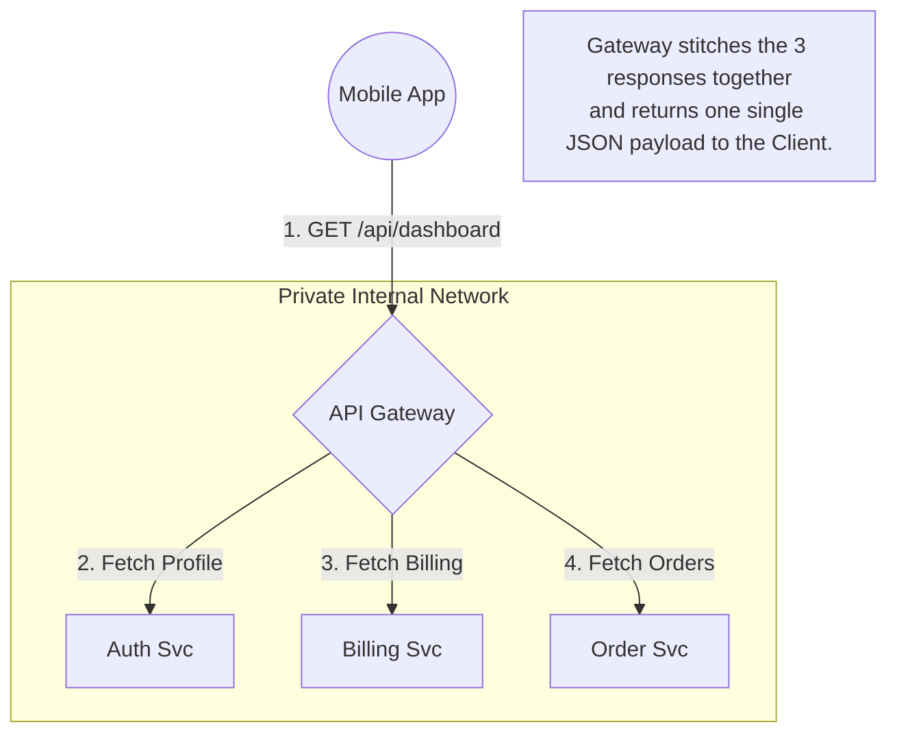

## Concept

In a microservices architecture, you might have 50 different backend services. If a mobile app needs to fetch a user profile, fetch their billing info, and fetch their recent orders, it shouldn't have to manage 50 different IP addresses and make 50 separate network calls across the public internet.
An **API Gateway** acts as the single, unified front door for your entire backend system. It sits between the public internet and your private microservices.

## Mental Model

## The 4 Primary Responsibilities

An API Gateway is much more than a simple router. It handles **Cross-Cutting Concerns**—things that every single microservice needs, so developers don't have to write the same code 50 times.

**1. Routing (Reverse Proxy):**
It routes `/api/users` to the User Service, and `/api/payments` to the Payment Service.

**2. Authentication & Authorization:**
Instead of building JWT validation into all 50 microservices, the API Gateway intercepts the request, validates the JWT, and rejects bad requests immediately. If valid, it forwards the request to the internal services, passing along the decrypted `user_id`.

**3. Rate Limiting & Throttling:**
It tracks IP addresses and API keys. If a user makes 10,000 requests a second, the Gateway drops the traffic at the edge, protecting the fragile internal microservices from being crushed.

**4. Request Aggregation (BFF Pattern):**
Also known as the **Backend-for-Frontend (BFF)** pattern. The Gateway receives one request from the mobile app (`GET /dashboard`), makes 3 separate parallel requests to the internal microservices, aggregates the JSON responses into a single payload, and sends it back to the mobile app, drastically reducing network latency.

## Trade-Offs

- **Pros:** Massively simplifies client-side code. Centralizes security. Protects internal APIs from being exposed to the public internet.
- **Cons:** 
  - **Single Point of Failure (SPOF):** If the Gateway goes down, your entire company is offline. (Must be highly available).
  - **Latency:** Every request now requires an extra network hop through the Gateway.
  - **Complexity bottleneck:** If every team has to update the Gateway routing rules to deploy a new service, the Gateway becomes a deployment bottleneck.

## Real-World Usage

- **AWS API Gateway:** The standard managed service in AWS. Scales infinitely and integrates perfectly with AWS Lambda serverless functions.
- **Kong / KrakenD / Nginx:** Popular open-source, highly performant API gateways.

## Interview Questions

**Q: A malicious user is launching a massive DDoS attack against your login endpoint. Should you implement rate-limiting inside your Node.js Authentication Service, or at the API Gateway?**
**A:** Absolutely at the **API Gateway** (or even further out, at the CDN/Cloudflare level). If you let the malicious traffic reach your internal Node.js Authentication Service, the attack has already won. The Node.js server will consume CPU and RAM just trying to parse the massive influx of HTTP requests to reject them, and it will eventually crash. The Gateway acts as a shield, dropping bad packets at the edge of the network before they consume internal compute resources.

**Q: How does the API Gateway handle SSL Termination, and why is it beneficial?**
**A:** Decrypting HTTPS (SSL/TLS) traffic is a CPU-intensive operation. If you have 50 microservices, forcing every single one of them to manage SSL certificates and burn CPU cycles decrypting traffic is horribly inefficient. 
Instead, the **API Gateway performs SSL Termination**. The public internet hits the Gateway via secure HTTPS. The Gateway uses its CPU to decrypt the traffic. It then forwards the raw, unencrypted HTTP traffic to the internal microservices over the secure, private internal VPC network. This centralizes certificate management and speeds up internal routing.
