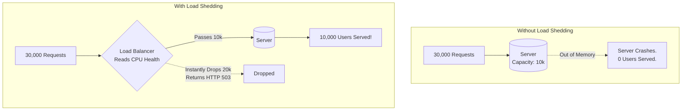

## Concept

**Rate Limiting** protects your system from *specific, malicious/abusive users* who exceed their quota. 
**Load Shedding** protects your system from *general, legitimate traffic* when the entire server cluster is pushed beyond its physical limits. 
If your servers can handle 10,000 requests per second, and a Super Bowl ad suddenly drives 30,000 requests per second to your site, the servers will run out of RAM and completely crash, resulting in 0 successful requests. Load Shedding is the architectural decision to intentionally drop 20,000 requests at the door, ensuring that at least 10,000 requests succeed perfectly.

## Mental Model

## How It Works

Load Shedding is a blunt instrument. It is usually implemented at the API Gateway or Load Balancer.

1. **Health Metrics:** The API Gateway constantly monitors the backend servers' health (CPU usage, RAM, active database connections, average response latency).
2. **The Threshold:** When the Gateway detects that the backend CPU has hit 90%, or the queue of waiting HTTP requests exceeds 500, the Load Shedding mode activates.
3. **The Drop:** The Gateway stops forwarding requests to the backend entirely. It instantly returns **HTTP 503 Service Unavailable** to the incoming traffic. It requires almost zero CPU to return a 503.
4. **Recovery:** Once the backend CPU drops back to 70%, the Gateway slowly opens the valves and begins routing traffic again.

## Prioritization (The VIP Pass)

Advanced Load Shedding does not drop traffic randomly. It prioritizes critical endpoints.
If the system is overloaded:
- **Priority 1 (Keep Alive):** Checkout and Payment API endpoints. You never drop these; they make money.
- **Priority 2 (Degrade):** Search API endpoints. You might drop 50% of this traffic.
- **Priority 3 (Shed First):** Background analytics processing, recommendation engines, or free-tier users. You instantly drop 100% of this traffic to free up CPU for the Priority 1 endpoints.

## Real-World Usage

- **Stripe:** Implements aggressive load shedding during massive Black Friday spikes to ensure core payment infrastructure never degrades.
- **Netflix:** The UI is designed around graceful degradation. If the Recommendation Engine API is load-shedded (dropped), the Netflix UI doesn't show an error. It simply hides the "Recommended for You" row and only shows standard genre lists, keeping the user completely unaware that the servers are melting down.

## Interview Questions

**Q: What is the "Thundering Herd" problem, and how can a poorly designed mobile app make Load Shedding infinitely worse?**
**A:** When the Load Balancer sheds load and returns an HTTP 503 error, a poorly coded mobile app might instantly run a `while(true)` loop to retry the request as fast as possible. If 20,000 users are dropped, they will instantly generate 100,000 retry requests per second. This is the Thundering Herd. Even though the Load Balancer is dropping the traffic, the sheer volume of 100,000 network connections will eventually crash the Load Balancer itself.
**Fix:** Clients must implement **Exponential Backoff with Jitter**. They must wait 1 second, then 2 seconds, then 4 seconds. The "Jitter" adds a random millisecond delay so that not all 20,000 phones attempt to reconnect at the exact same millisecond.
