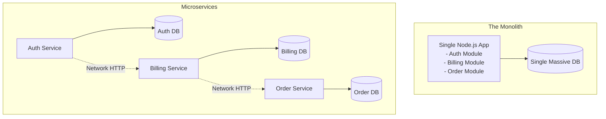

## Concept

When you build an application, how do you structure the codebase and the deployments?
A **Monolith** puts all features (Auth, Billing, Orders) into one massive codebase, compiled into one program, running on one server.
**Microservices** break the application into dozens of small, independent programs (one for Auth, one for Billing, one for Orders) that communicate with each other over a network.

## Mental Model

## The Monolith

**Pros:**
- **Simplicity:** Extremely easy to develop, test locally, and deploy.
- **Performance:** When the Order feature needs to check User Auth, it just calls a local function in memory (1 nanosecond).
- **Data Integrity:** Everything shares one database. You can easily use standard SQL `JOIN`s and ACID transactions.

**Cons:**
- **Scaling:** If the 'Image Upload' feature uses 100% of the CPU, the entire Monolith crashes, taking down the 'Checkout' feature with it. You have to scale the *entire* massive application, which is expensive.
- **Team Bottlenecks:** When 100 developers push code to the same repository daily, merge conflicts and deployment queues become a nightmare. 

## Microservices

**Pros:**
- **Independent Scaling:** If Image Uploads require massive CPU, you can deploy 50 instances of just the `Upload Service`, while keeping the `Checkout Service` on a single cheap server.
- **Independent Deployments:** The Auth team can deploy to Production 5 times a day in Go. The Billing team can deploy once a week in Python. They don't block each other.
- **Fault Isolation:** A memory leak in the `Notification Service` will crash that service, but users can still seamlessly browse the store and checkout.

**Cons:**
- **The "Distributed Big Ball of Mud":** Instead of local function calls, services must communicate over HTTP/Kafka. This introduces horrific network latency, partial failures, and complex retry logic.
- **Data Fragmentation:** Services are strictly forbidden from sharing databases (otherwise they aren't independent). To get a user's Order History and Profile, you have to query two different databases over the network, or implement complex Event Sourcing.
- **Operational Hell:** You now need Kubernetes, API Gateways, Distributed Tracing, and Service Meshes just to keep the system running.

## Real-World Usage

- **The Golden Rule:** **Start with a Monolith.** 
- 99% of startups do not have the scale or the engineering team size to justify the massive operational overhead of Kubernetes and Microservices.
- You should only extract a Microservice from a Monolith when it naturally demands it (e.g., extracting the PDF generation logic because it's consuming too much CPU, or extracting the Payment logic because the Billing team needs to deploy independently). 
- Companies like Uber and Netflix use Microservices because they have 5,000+ engineers.

## Interview Questions

**Q: A team decides to split their Monolith into Microservices. However, all 10 microservices still connect to the exact same shared PostgreSQL database. What anti-pattern have they created?**
**A:** They have created a **Distributed Monolith**. This is the worst of both worlds. They took on all the networking latency and deployment complexity of microservices, but achieved zero independence. If the database schema needs to change, or the database goes down, all 10 microservices crash simultaneously. True microservices must have **Database per Service** isolation.

**Q: In a Microservices architecture, Service A calls Service B synchronously over HTTP. Service B is currently down. If Service A waits for a response indefinitely, it will run out of memory. How do you prevent this?**
**A:** You must implement the **Circuit Breaker Pattern**. Service A wraps its HTTP call in a Circuit Breaker tool. If Service B fails 5 times in a row, the Circuit Breaker "trips" (opens). For the next 30 seconds, Service A completely stops trying to call Service B, instantly returning a fallback error to the user without making the network call. This gives Service B time to recover instead of crushing it with retries, and prevents Service A from exhausting its own threads.
