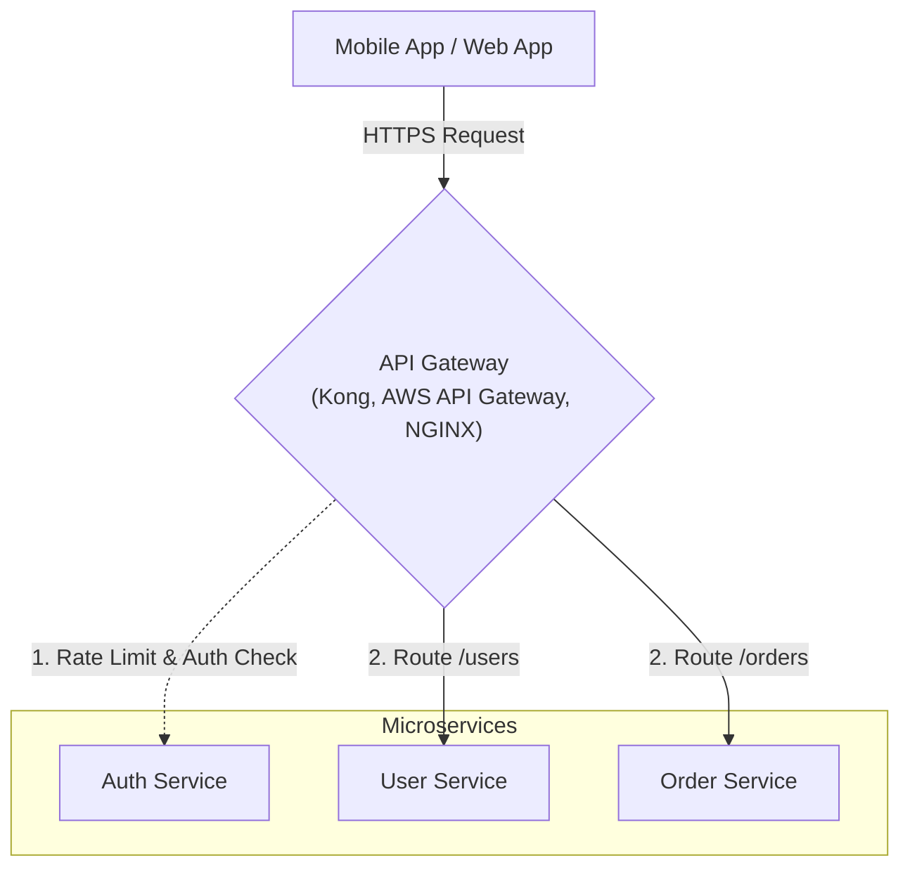

## TL;DR

An API Gateway is a server that acts as an API front-end, receiving API requests, enforcing throttling and security policies, passing requests to the back-end service, and then passing the response back to the requester.

## Mental Model

## Key Responsibilities

1. **Routing (Reverse Proxy)**: Directs incoming requests to the appropriate microservice based on the URL path (e.g., `/api/users` goes to the User Service).
2. **Authentication/Authorization**: Validates JWT tokens or API keys centrally, so each individual microservice doesn't have to duplicate auth logic.
3. **Rate Limiting**: Protects backend services from DDoS attacks or runaway clients by throttling requests.
4. **Load Balancing**: Distributes traffic across multiple instances of the same microservice.
5. **SSL Termination**: Decrypts incoming HTTPS traffic so backend services can communicate over fast, unencrypted HTTP within the private network.
6. **Response Aggregation**: Combines responses from multiple microservices into a single payload for the client (GraphQL often serves this purpose).

## Interview Questions

### What is the Backend-for-Frontend (BFF) pattern?
Instead of a single, massive API Gateway for all clients, you create a separate API Gateway for *each type of client* (e.g., one gateway for the iOS app, one for the Web app, one for IoT devices). This allows the gateway to tailor the aggregated data exactly to what that specific UI needs, preventing over-fetching.

### What happens if the API Gateway fails?
Since the API Gateway is the single entry point to your entire system, it is a massive **Single Point of Failure (SPOF)**. It must be highly available, usually deployed as a cluster of multiple gateways placed behind a network load balancer.

## Common Gotchas

*   **Gateway Routing Bottlenecks**: Putting heavy business logic or data transformation into the API Gateway itself. The gateway should be "dumb pipes"—it routes, secures, and limits, but it shouldn't be running complex custom code, or it becomes a monolithic bottleneck.

## Remember

> Don't expose your microservices directly to the internet. Always put them behind an API Gateway.
