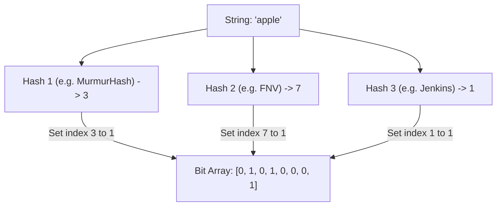

## TL;DR

A Bloom Filter is an incredibly memory-efficient data structure that can quickly tell you if an item is **definitely not** in a set, or **probably** in a set. False positives are possible, but false negatives are impossible.

## Mental Model

*To check if "apple" exists, run it through the same 3 hash functions. If indexes 1, 3, and 7 are all `1`, it is PROBABLY in the set. If even one of them is `0`, it is DEFINITELY NOT in the set.*

## Why use it?

Checking if a user ID exists in a database of 1 billion users is slow (requires disk I/O). Caching all 1 billion IDs in a Redis Hash Set would take massive amounts of RAM. 
A Bloom filter representing 1 billion users might only take ~1.2 GB of RAM. You put the Bloom filter in front of the database. 
- If the filter says "Definitely Not", you instantly return a 404 without touching the DB.
- If the filter says "Probably Yes", you query the slow DB to confirm.

## Use Cases

1. **Malicious URLs**: Chrome uses a local Bloom filter to check if a URL is malicious. If "Probably Yes", it does a slow network request to Google's servers to verify.
2. **Username Availability**: When signing up for a new account, a Bloom filter can instantly reject usernames that are already taken.
3. **Database Engines**: Cassandra and Postgres use Bloom filters internally to avoid reading disk blocks that definitely don't contain the requested row.

## Interview Questions

### Can you remove an item from a Bloom Filter?
**No**. Because multiple items might have hashed to the exact same bit index (a collision), setting a `1` back to a `0` might accidentally delete other items in the set. (To support deletions, you must use a more complex *Counting Bloom Filter*).

### How do you control the False Positive rate?
By tuning two parameters:
1. The size of the bit array ($m$).
2. The number of hash functions ($k$).
A larger array reduces collisions. More hash functions distribute the bits more uniquely, but take longer to compute.

## Common Gotchas

*   **High False Positive Rate**: If you insert too many items into a small Bloom Filter, eventually every single bit in the array will become `1`. At that point, the filter will return "Probably Yes" for *everything*, rendering it completely useless.

## Remember

> Bloom Filters save you from doing expensive work (like DB queries or network calls) by quickly proving that the work doesn't need to be done.
