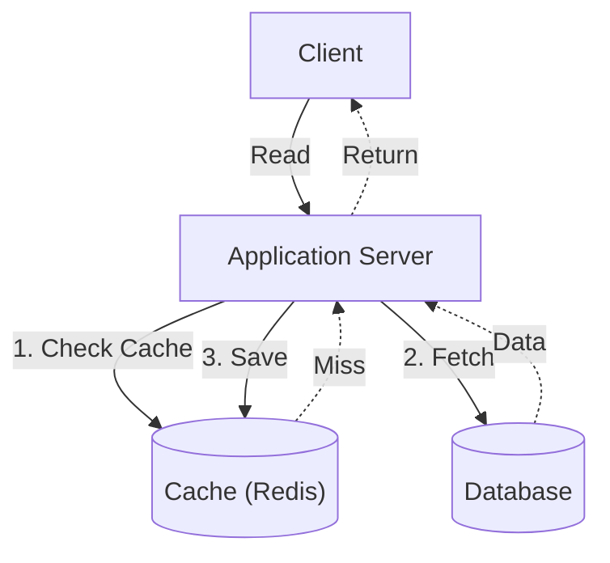

## TL;DR

Caching stores copies of frequently accessed data in fast, temporary storage (like RAM using Redis or Memcached) to reduce database load and improve read latency.

## Mental Model

*The Cache-Aside Pattern: The application is responsible for reading and writing from both the cache and the database.*

## Caching Strategies

### 1. Cache-Aside (Lazy Loading)
- **How it works**: The app checks the cache. If hit, return data. If miss, fetch from DB, save to cache, and return.
- **Pros**: Only requested data is cached. Cache failures don't break the system (just slows it down).
- **Cons**: First request is always slow (cache miss). Data can become stale.

### 2. Write-Through
- **How it works**: The app writes data to the cache AND the database at the same time.
- **Pros**: Data in the cache is never stale. Fast reads.
- **Cons**: Slower writes (requires two network calls). Caches unused data if it's never read.

### 3. Write-Back (Write-Behind)
- **How it works**: The app writes data *only* to the cache. An async process later syncs the cache to the database.
- **Pros**: Blazing fast writes and reads. Great for write-heavy workloads.
- **Cons**: High risk of data loss if the cache crashes before syncing to the DB.

## Interview Questions

### What is the Thundering Herd problem and how do you prevent it?
When a highly requested cache key expires, thousands of concurrent requests might experience a cache miss at the same time and all query the database, bringing it down. 
**Fixes**: Add a slight random jitter to TTLs, or use a mutex lock so only the *first* thread queries the DB and repopulates the cache while others wait.

### What eviction policies do caches use?
- **LRU (Least Recently Used)**: Evicts data that hasn't been requested in the longest time. (Most common).
- **LFU (Least Frequently Used)**: Evicts data that is requested the least amount of times overall.
- **FIFO (First In First Out)**: Evicts the oldest data regardless of usage.

## Common Gotchas

*   **Caching user-specific data globally**: Never cache a page containing private user data under a generic key, or user A might see user B's data!
*   **Missing TTLs**: Always set a Time-To-Live (TTL) on cache keys to prevent memory leaks and bound the maximum staleness of data.

## Remember

> Caching is the ultimate band-aid for slow reads, but it introduces the hardest problem in computer science: cache invalidation.
