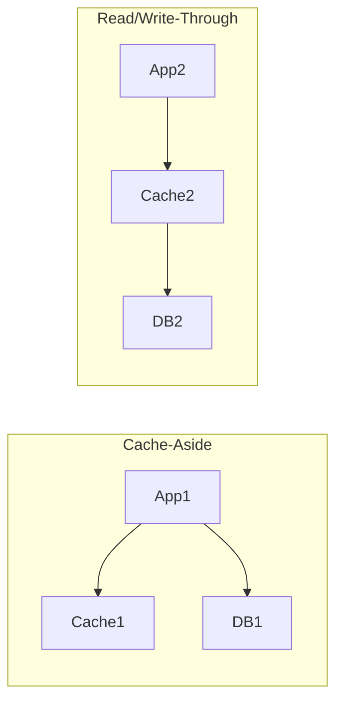

## Concept

When you introduce a Cache alongside a Database, you now have two separate systems storing the same data. You must choose a strict strategy for how the application reads from and writes to these two systems to keep them synchronized.

## The 4 Primary Strategies

### 1. Cache-Aside (Lazy Loading)
The most common strategy. The Cache sits to the "side" of the database. The Application is responsible for orchestrating both.
- **Read:** App checks Cache. If Miss, App queries DB, then App saves to Cache, then returns.
- **Write:** App writes to the DB. Then, the App explicitly deletes (invalidates) the key in the Cache. The next read will cause a cache miss and fetch the fresh data.
- **Pros:** Resilient. If the Cache crashes, the App just falls back to querying the DB directly. Only data that is actually requested is cached.

### 2. Read-Through
The Cache sits *in front* of the database. The Application only ever talks to the Cache.
- **Read:** App queries the Cache. If Miss, the *Cache itself* (using a plugin or provider) queries the DB, updates its own memory, and returns to the App.
- **Pros:** Simplifies application code (the App doesn't know the DB exists).
- **Cons:** If the Cache crashes, the App cannot talk to the DB. Complete system failure.

### 3. Write-Through
The App only writes to the Cache. The Cache synchronously writes to the Database before acknowledging the request.
- **Write:** App writes to Cache -> Cache writes to DB -> Returns Success.
- **Pros:** Perfect data consistency. The cache is never stale.
- **Cons:** High write latency. Every write operation suffers the delay of writing to both RAM and Disk sequentially.

### 4. Write-Back (Write-Behind)
The App writes data directly to the Cache and returns "Success" instantly to the user. The Cache then asynchronously writes the data to the Database in the background later.
- **Write:** App writes to Cache -> Returns Success -> (Seconds later) Cache bulk-writes to DB.
- **Pros:** Unbeatable write performance and throughput.
- **Cons:** Extremely dangerous. If the Cache server crashes before the background worker flushes the data to the DB, the data is permanently lost.

## Mental Model

## Interview Questions

**Q: In the Cache-Aside pattern, when you update a user's profile, why do we *delete* the cache key instead of just *updating* the cache key with the new data?**
**A:** Updating the cache key directly introduces a severe **Race Condition**. 
Imagine User A and User B update the profile at the exact same time.
1. User A writes "Alice" to the DB.
2. User B writes "Bob" to the DB.
3. User B updates the Cache to "Bob".
4. User A (who experienced a network hiccup) updates the Cache to "Alice".
Now, the Database says "Bob", but the Cache says "Alice". The data is permanently corrupted until the TTL expires.
By *deleting* the key instead, the next read operation will simply fetch the true value from the DB. Deletions are idempotent and safe.

**Q: You are building a massive multiplayer game where player coordinates update 60 times a second. Writing this to a PostgreSQL database will crush the disk. Which caching strategy do you use?**
**A:** You must use the **Write-Back (Write-Behind)** strategy. The game server writes the player coordinates directly into Redis RAM 60 times a second. Every 5 seconds, a background worker takes the final position from Redis and commits it to the PostgreSQL database in a single batch insert. If the server crashes, you lose 5 seconds of player movement, which is an acceptable trade-off for the massive write-throughput gained.
