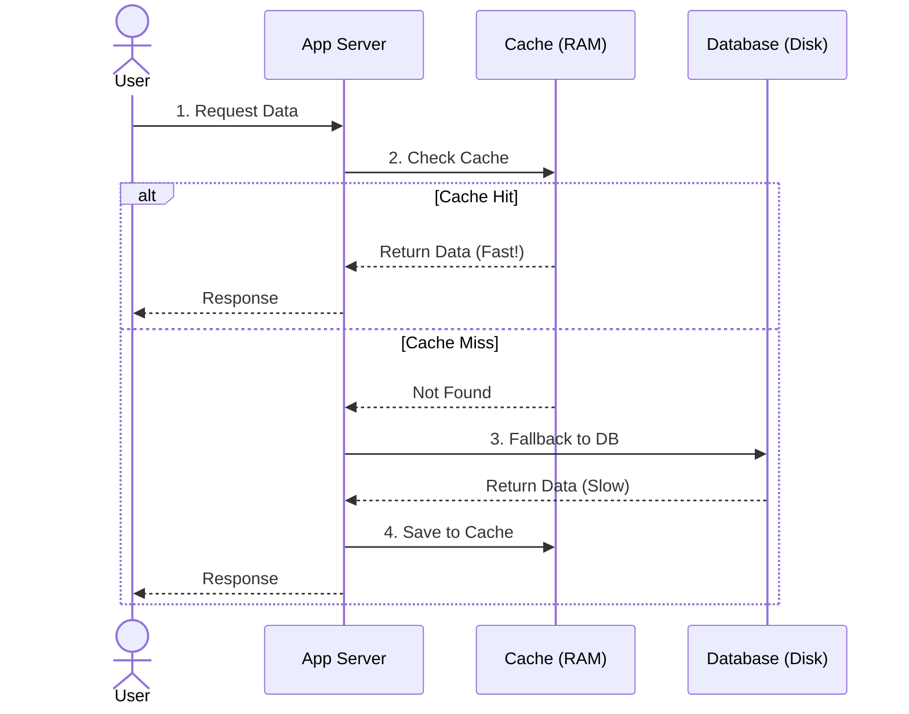

## Concept

Fetching data from a hard drive (Database) or over the network is inherently slow. A **Cache** is a temporary storage layer that stores a subset of data in high-speed RAM (Random Access Memory). The goal is to serve future requests for that data instantly, bypassing the slow database entirely.

## Mental Model

## How It Works

**The Speed Difference:**
- Reading from a typical Database (SSD Disk): ~1 millisecond (1,000,000 nanoseconds).
- Reading from a Cache (RAM): ~100 nanoseconds.
*Caching is approximately 10,000 times faster than reading from a disk.*

**Where do we cache?**
Caching can happen at almost every layer of a system:
1. **Client/Browser Cache:** The user's browser saves images and CSS to their local hard drive.
2. **CDN Cache:** Edge nodes save static files globally.
3. **Web Server Cache:** Nginx caches full HTML page responses.
4. **Application Cache:** Node.js saves data in a local variable or a `Map()`.
5. **Distributed Cache:** A dedicated cluster of Redis servers holding database query results.
6. **Database Cache:** PostgreSQL automatically holds frequently accessed rows in its own internal memory buffer.

## Trade-Offs

- **Pros:** Massive reduction in Latency. Protects the primary database from being crushed by read-heavy traffic (improves Throughput).
- **Cons:** RAM is extremely expensive compared to hard drives. Cache introduces **Data Stale-ness**. If the underlying database changes, the cache is now holding incorrect data until it is explicitly cleared or expires. "Cache Invalidation is one of the two hardest things in computer science."

## Real-World Usage

- **User Sessions:** When a user logs in, storing their Session ID and permissions in Redis ensures that every subsequent API request doesn't require a slow database lookup to verify their identity.
- **Computed Results:** If rendering the Top 10 Leaderboard requires scanning 5 million rows and taking 3 seconds, you should compute it once, save the HTML/JSON to the cache, and serve it to the next 100,000 users instantly.

## Interview Questions

**Q: A celebrity tweets to their 50 million followers. This generates 1 million read requests per second to your database, causing it to crash. You add a Cache in front of it. What happens when the cache expires?**
**A:** This causes a **Cache Stampede (Thundering Herd)**. When the cache expires, the next 10,000 simultaneous requests will all experience a "Cache Miss". Because they all missed, all 10,000 requests will immediately hit the database at the exact same millisecond to recalculate the tweet, crashing the database instantly.
**Fix:** You can use a Mutex Lock (so only 1 request is allowed to fetch from the DB while the other 9,999 wait for the cache to populate), or you can use a background worker to proactively refresh the cache *before* it actually expires.

**Q: You decide to cache every single user's profile data in Redis. Your RAM usage hits 100% and the server crashes. How do you prevent this?**
**A:** A cache is not a database; it is not meant to hold *all* data. You must configure an **Eviction Policy** (like LRU - Least Recently Used) and set a strict memory limit on the Redis server. When the RAM reaches the limit, Redis will automatically delete the oldest, least accessed profiles to make room for new ones.
