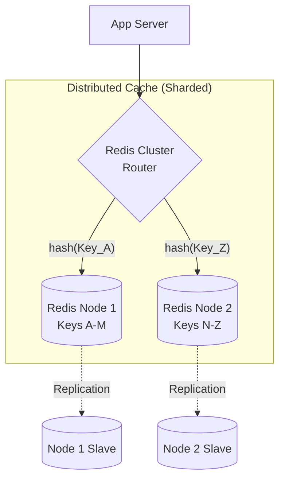

## Concept

When your cache needs to hold 500GB of data, you cannot fit it into the RAM of a single standard server. You must scale horizontally by creating a **Distributed Cache**—a cluster of multiple cache servers (nodes) that act together as a single logical cache.

## Mental Model

## How It Works

A Distributed Cache combines two major database concepts: **Sharding** and **Replication**.

**1. Sharding (Partitioning) for Capacity:**
The data is partitioned across multiple nodes using **Consistent Hashing**. If you store `user:123`, the router hashes the key and places it on Node 1. If you store `user:999`, it places it on Node 2. This allows you to combine the RAM of 5 separate 100GB servers into a single 500GB virtual cache.

**2. Replication for Availability:**
If Node 1 crashes, you instantly lose 100GB of cached data, triggering a massive database spike. To prevent this, every Master node has a Slave (Replica) node. The Master asynchronously replicates its RAM to the Slave.

**3. Failover (Gossip Protocol):**
The nodes constantly ping each other (Gossip). If Node 1 dies, the other nodes agree it is dead, and automatically promote Node 1's Slave to become the new Master. The cluster heals itself without downtime.

## Trade-Offs

- **Pros:** Infinite RAM capacity. Highly available. Survives node failures.
- **Cons:** High operational complexity. **Multi-Key Operations fail:** If you try to run a transaction or a `JOIN` across `user:123` and `user:999`, the cache will throw an error because those two keys physically live on completely different servers across the network.

## Real-World Usage

- **Redis Cluster:** The official distributed solution for Redis. It automatically handles sharding (splitting data into 16,384 Hash Slots) and failover.
- **Client-Side Sharding:** Some legacy systems don't use a cluster coordinator. Instead, the Node.js application itself holds an array of 5 Memcached IP addresses and runs the consistent hashing algorithm locally to decide which IP to send the data to.

## Interview Questions

**Q: In a Redis Cluster, how do you solve the issue of Multi-Key operations failing because the keys live on different shards?**
**A:** Use Redis Hash Tags. Put the portion that should determine key placement inside `{}`. For example, `user:{123}:profile` and `user:{123}:settings` both hash only `123`, so they are assigned to the same hash slot. This lets Redis Cluster execute multi-key operations and transactions involving those keys without a cross-slot error.

**Q: What is a "Cache Stampede", and how does adding a distributed cache sometimes accidentally cause it?**
**A:** A Cache Stampede happens when a highly popular cache key expires, and thousands of concurrent users instantly query the main database simultaneously to recalculate it. 
In a poorly configured distributed cache, if a single Node crashes, the hashing algorithm might instantly map all of that node's traffic to the remaining nodes. Those nodes will report "Cache Misses" for the new traffic, causing a massive stampede that brings down the primary database. This is why **Replicas** and **Consistent Hashing** are mandatory for distributed caches.
