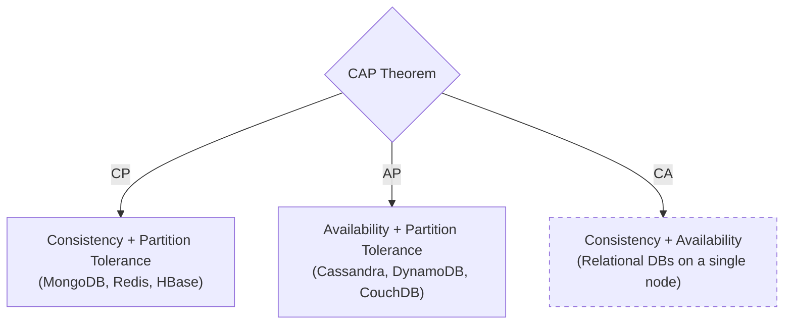

## TL;DR

The CAP theorem states that in a distributed system subject to network failures (Partitions), you must choose between prioritizing **Consistency** (always returning the right data, or an error) or **Availability** (always returning data, even if it's stale).

## Mental Model

*Note: CA is technically impossible in a true distributed system because network partitions (P) WILL happen.*

## The Three Pillars

1. **Consistency (C)**: Every read receives the most recent write or an error. All nodes see the exact same data at the exact same time.
2. **Availability (A)**: Every request receives a non-error response, without the guarantee that it contains the most recent write.
3. **Partition Tolerance (P)**: The system continues to operate despite an arbitrary number of messages being dropped or delayed by the network between nodes.

## How to Choose

Because networks are unreliable, **P is a given**. You must choose between CP or AP during a network split.

*   **Choose CP (Consistency)**: When atomic reads and writes are strictly required (e.g., Banking systems, inventory management). If a node can't guarantee it has the latest data, it returns an error.
*   **Choose AP (Availability)**: When the system needs to continue functioning at all costs, and eventual consistency is acceptable (e.g., Social media feeds, shopping carts, likes).

## Interview Questions

### If a system is AP, does it mean it's never Consistent?
No. AP systems use **Eventual Consistency**. When the network partition is resolved, the nodes will sync up and eventually become consistent.

### How does PACELC extend the CAP theorem?
CAP only describes behavior *during a partition*. PACELC extends it to describe behavior *during normal operation*.
If **P**artition, choose **A**vailability or **C**onsistency.
**E**lse (normal operation), choose **L**atency or **C**onsistency.

## Common Gotchas

*   Assuming RDBMS (like Postgres) can never be distributed. They can be, using synchronous replication (which makes them CP, sacrificing Availability if a node goes down).

## Remember

> In the real world, networks fail. You can't avoid P. Therefore, you are always choosing between **C** (correctness) and **A** (uptime).
