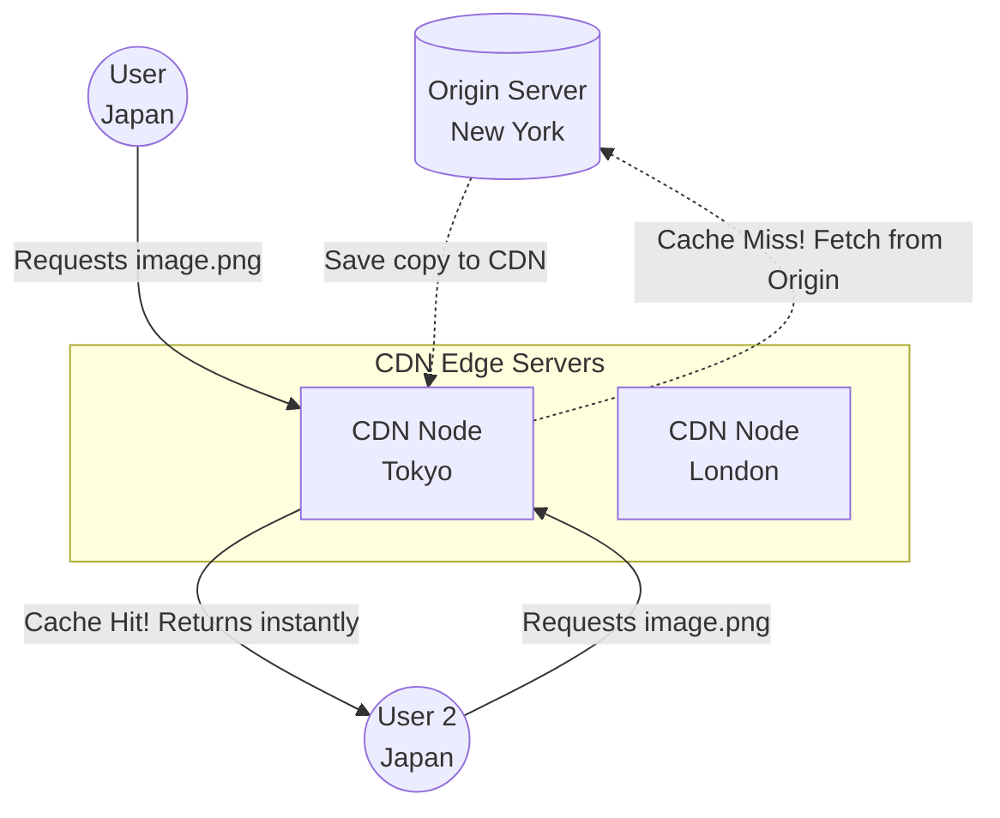

## Concept

No matter how fast your backend code is, physics limits how fast data travels. A request from Tokyo to a server in New York takes ~150ms due to the speed of light in fiber optics.
A **CDN (Content Delivery Network)** is a globally distributed network of proxy servers. Instead of forcing the Tokyo user to fetch an image from New York, the CDN stores a copy of that image on a server physically located in Tokyo. The request drops from 150ms to 10ms.

## Architecture Diagram

## How It Works

1. **The Origin:** You host your application and database on your main servers (the Origin) in a specific region (e.g., AWS `us-east-1`).
2. **The Edge (PoP):** The CDN provider (like Cloudflare or Akamai) has thousands of servers located in major cities worldwide, known as Points of Presence (PoPs) or Edge Nodes.
3. **DNS Routing:** When a user visits your site, the DNS resolution directs them to the closest CDN Edge Node, NOT your Origin.
4. **Pull Zone (Lazy Loading):** If the Edge Node doesn't have the requested file (Cache Miss), it acts as a proxy, fetches it from the Origin, sends it to the user, and saves a copy on its own hard drive. The next user in that city gets the file instantly (Cache Hit).

## What Should Be Cached?

- **Static Content (YES):** Images (`.jpg`, `.png`), Videos (`.mp4`), CSS stylesheets, JavaScript bundles, HTML landing pages, Fonts. These rarely change and are identical for every user.
- **Dynamic Content (NO):** User profile data, shopping cart contents, bank balances. These are unique per user and change constantly. (Though modern CDNs offer *dynamic acceleration* via optimized routing, they don't cache this data).

## Real-World Usage

- **Cloudflare / CloudFront / Akamai / Fastly:** The major players. 
- **Video Streaming:** Netflix and YouTube literally could not exist without CDNs. They install specialized CDN hardware directly inside Internet Service Provider (ISP) facilities (like Comcast) so videos are served from the user's local neighborhood.
- **DDoS Protection:** CDNs act as massive shock absorbers. If a botnet attacks your site with 10 million requests per second, the CDN absorbs the traffic across thousands of global servers, dropping the malicious packets before they ever reach your fragile Origin server.

## Interview Questions

**Q: A developer updates the company logo (`logo.png`) on the Origin server, but users are complaining they still see the old logo. Why, and how do you fix it?**
**A:** The CDN Edge Nodes have cached the old `logo.png` and are serving it without checking the Origin. There are two fixes:
1. **Cache Invalidation:** Log into the CDN dashboard and manually trigger a "Purge" or "Invalidate" command for that URL. This forces all Edge Nodes to delete the file. (This can be slow and expensive).
2. **Cache Busting / Versioning (Preferred):** Never overwrite files. Name the new file `logo_v2.png` or `logo_a8f9c.png` (using a hash of the file contents). Update the HTML to point to the new URL. The CDN treats this as a brand new request, fetches the new file, and the problem is solved instantly.
