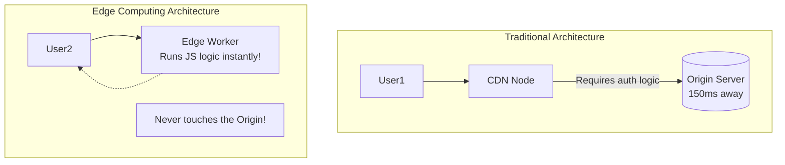

## Concept

Traditionally, CDNs only served "dumb" static files (images, CSS). If a request required any logic or database access, the CDN had to route the request all the way back to the centralized Origin server.
**Edge Computing** changes this. It allows developers to run serverless functions (like AWS Lambda@Edge or Cloudflare Workers) directly on the CDN's hardware, mere milliseconds away from the user.

## Mental Model

## How It Works

Providers like Cloudflare deploy the V8 JavaScript Engine directly onto their Edge Nodes in 200+ cities. When a request hits the local node, it spins up a highly restricted, lightweight JS isolate in under 5 milliseconds to execute your code.

**What can an Edge function do?**
1. **A/B Testing:** Inspect the user's cookies, decide if they are in the 'Test' or 'Control' group, and serve different HTML.
2. **Authentication:** Check a JWT token in the request header. If it's invalid, return a 401 Unauthorized instantly, saving the Origin server from having to process the bad request.
3. **Image Optimization:** Intercept a request for a massive `hero.jpg`. Detect if the user's browser supports WebP, resize the image dynamically based on their mobile screen width, cache the result, and serve it.
4. **Geo-Routing:** Detect the user's physical country and automatically redirect them to the correct localized domain (e.g., `.co.uk`).

## Trade-Offs

- **Pros:** Massive reduction in latency. Drastically reduces compute load and bandwidth costs on your Origin server. 
- **Cons:** Edge functions are highly constrained. They have strict execution time limits (e.g., 50ms). They cannot use standard Node.js modules (like `fs` or native C++ addons). They are terrible at complex database writes because the database is still located far away at the Origin.

## Real-World Usage

- **Cloudflare Workers:** The most popular Edge compute platform. Developers build entire APIs that run globally without ever provisioning a central server.
- **Next.js Edge Middleware:** Vercel allows you to write middleware that runs at the Edge before a page renders, often used for internationalization routing or checking auth cookies before serving a static page.
- **Edge Databases:** Companies like Turso (libSQL) and Cloudflare D1 are deploying distributed SQLite databases to the Edge so Edge functions can perform data reads locally without querying the Origin.

## Interview Questions

**Q: You want to implement an IP-based Rate Limiter to stop scrapers. Should you put this logic in your main Node.js application, or in an Edge Function?**
**A:** It should absolutely go in the Edge Function (or API Gateway). If you put it in the main Node app, the malicious scraper has already consumed bandwidth, traversed the internet, and utilized CPU cycles on your infrastructure just to be told "No." An Edge Function intercepts the scraper at the ISP level and drops the connection instantly, protecting your core infrastructure from the load.

**Q: Why is it a bad idea to do heavy database inserts (like saving an order to PostgreSQL) from an Edge Worker?**
**A:** The Edge Worker runs locally near the user (e.g., Tokyo). But your primary PostgreSQL database is likely centralized (e.g., US-East). Every time the Edge Worker runs a query, it has to open a TCP/SSL connection across the Pacific Ocean, suffering the exact 150ms latency penalty you were trying to avoid. Edge computing is best for logic that does NOT rely on centralized, mutable state.
