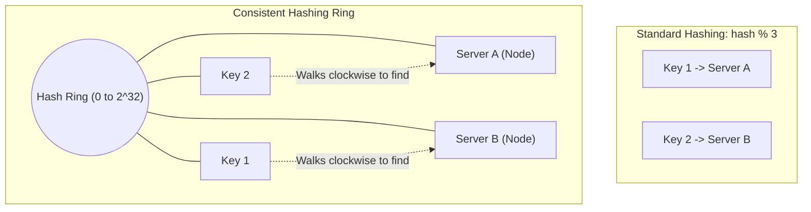

## TL;DR

Standard hashing (`hash(key) % N`) forces you to remap almost every single key if the number of servers (`N`) changes. Consistent Hashing places servers and keys onto a "hash ring", ensuring that when a server is added or removed, only a tiny fraction of keys need to be moved.

## Mental Model

## The Problem with Modulo Hashing
If you have 4 Redis cache servers, you map data using `hash(key) % 4`.
If Server 4 crashes, `N` becomes 3. 
Suddenly, `hash(key) % 3` yields a completely different server for 90% of your keys. This causes a massive "cache miss storm" that instantly brings down your database.

## How Consistent Hashing Solves It

1. **The Hash Ring**: Imagine a circle representing all possible hash values (e.g., $0$ to $2^{32}-1$).
2. **Place Servers**: Hash the *IP addresses* of your servers and place them on the ring.
3. **Place Keys**: Hash your data *keys* and place them on the same ring.
4. **Routing**: To find which server holds a key, walk **clockwise** around the ring starting from the key's position until you hit a server.
5. **Scaling**: If a server crashes and is removed from the ring, only the keys that mapped to it are pushed clockwise to the *next* server. All other keys remain exactly where they are.

## Interview Questions

### What is the "Non-Uniform Distribution" problem?
If you only have 3 servers on a massive ring, they might end up clustered close together, meaning one server ends up handling 80% of the ring's capacity.

### How do you fix Non-Uniform Distribution?
Using **Virtual Nodes (V-Nodes)**. Instead of hashing Server A once, you hash it 100 times using a suffix (`ServerA_01`, `ServerA_02`...). This places 100 "virtual" points for Server A scattered randomly around the ring. Doing this for all servers guarantees a perfectly even distribution of load.

## Common Gotchas

*   **Implementation Complexity**: Writing a consistent hashing algorithm from scratch is tricky (usually involving a Binary Search Tree to quickly find the next clockwise node). Thankfully, modern distributed databases (Cassandra, DynamoDB) and caching clients handle it internally.

## Remember

> Consistent Hashing decouples the hash logic from the *exact number* of servers, allowing elastic scaling of distributed caches and databases.
