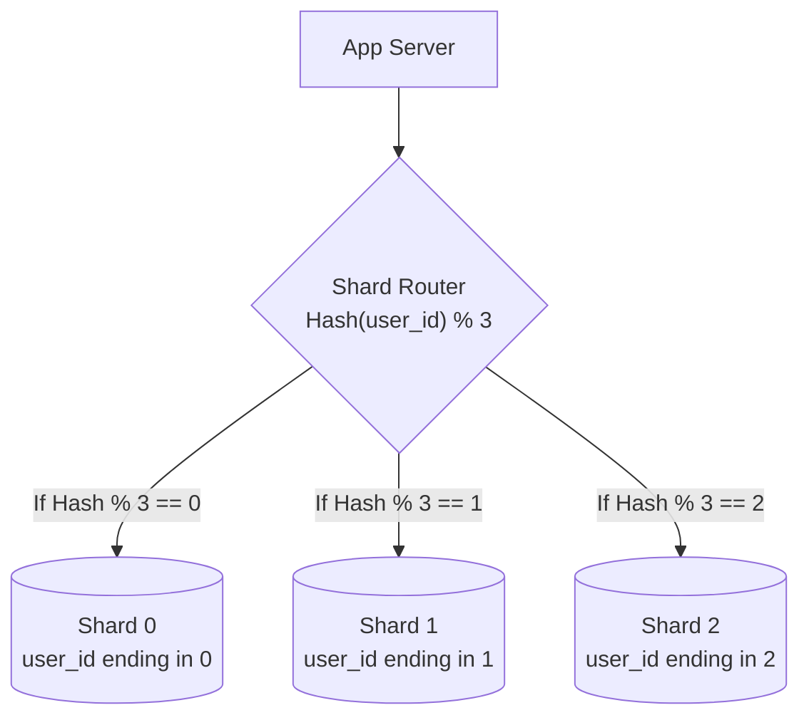

## TL;DR

Sharding is horizontal partitioning. It involves breaking up a massive database table and distributing the rows across multiple database servers based on a "Shard Key" to improve read/write throughput and storage limits.

## Mental Model

## Sharding Strategies

### 1. Hash Sharding
Compute a hash of the shard key (e.g., `user_id`) and modulo by the number of shards. 
- **Pros**: Evenly distributes data across servers.
- **Cons**: Adding or removing a server changes the modulo math (`hash % N` vs `hash % N+1`), requiring massive data migration. (Solved by *Consistent Hashing*).

### 2. Range Sharding
Data is divided into ranges based on the shard key (e.g., A-M goes to Shard 1, N-Z goes to Shard 2).
- **Pros**: Easy to implement. Great for range queries (e.g., "get all users between 1000 and 2000").
- **Cons**: High risk of "hotspots". If you shard by date, the server handling "today" will be overwhelmed while older shards sit idle.

### 3. Directory (Lookup) Sharding
A central mapping table keeps track of which shard holds which data.
- **Pros**: Maximum flexibility. You can dynamically move data and update the lookup table.
- **Cons**: The lookup table becomes a single point of failure and a performance bottleneck.

## Interview Questions

### What happens if you run a `JOIN` across shards?
It is extremely slow or impossible. Relational databases are not designed to join data across physical servers. You either have to execute two separate queries in your app and join them in memory, or denormalize your data so related data always lives on the same shard.

### How do you choose a Shard Key?
A good shard key must:
1.  **High Cardinality**: Have many possible values.
2.  **Even Distribution**: Prevent hotspots.
3.  **Align with Queries**: Most of your queries should include the shard key so the router knows exactly which server to query, preventing "Scatter-Gather" queries (querying *all* shards and merging the results).

## Common Gotchas

*   **Celebrity Problem (Hotspots)**: If you shard a social network by `user_id`, Justin Bieber's shard will be overwhelmed with traffic. You may need to further partition high-traffic keys or heavily cache them.

## Remember

> Sharding introduces massive complexity (cross-shard joins, distributed transactions). It is the absolute last resort after caching, indexing, vertical scaling, and read replicas have failed.
