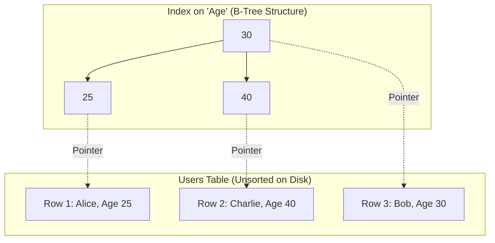

## Concept

If you want to find a specific word in a 1,000-page book, reading every single page is incredibly slow. Instead, you go to the Index at the back of the book, find the word, and it tells you exactly which page to turn to.
A **Database Index** works exactly the same way. It is a separate data structure (usually a B-Tree) that keeps a specific column sorted, allowing the database to look up rows in $O(\log N)$ time instead of $O(N)$ time.

## Mental Model

## How It Works: B-Trees

Most relational databases (PostgreSQL, MySQL) use B-Trees (Balanced Trees) for indexes.
When you run `SELECT * FROM users WHERE age = 40;`:
- **Without an Index:** The DB performs a **Full Table Scan**. It reads every single row from disk to check the age. If the table has 100 million rows, this takes seconds/minutes.
- **With an Index:** The DB traverses the B-Tree. It checks the root node (30). 40 is greater than 30, so it goes right. It finds 40, reads the hidden pointer attached to it, goes directly to that exact byte on the hard drive, and returns the row. It takes 3 operations instead of 100 million.

## Trade-Offs

Indexes drastically speed up Read operations, but they heavily penalize Write operations.
- **The Write Penalty:** Every time you `INSERT`, `UPDATE`, or `DELETE` a row in the table, the database must also write to and rebalance the B-Tree index. 
- **Storage Cost:** Indexes are separate data structures. Creating an index on 5 different columns might double the amount of disk space the database requires.

## Real-World Usage

- **Primary Keys:** Databases automatically create a clustered index on the Primary Key column.
- **Foreign Keys:** You should almost always manually add an index to Foreign Key columns, because they are heavily used in `JOIN` operations.
- **Composite Indexes:** If you frequently query `WHERE last_name = 'Doe' AND first_name = 'John'`, creating a single index on `(last_name, first_name)` is much faster than creating two separate indexes.

## Interview Questions

**Q: You have an index on the `status` column (which only contains 'ACTIVE' or 'INACTIVE'). The table has 10 million rows. You query `WHERE status = 'ACTIVE'`. Why is the database ignoring your index and doing a full table scan anyway?**
**A:** This is a problem of **Low Cardinality**. An index is only useful if it narrows down the results significantly. If 90% of the rows are 'ACTIVE', traversing the B-Tree and then jumping around the disk to fetch 9 million rows is actually slower than just sequentially reading the entire disk from start to finish. The Database Query Planner is smart enough to realize the index is useless and ignores it.

**Q: What is a Covering Index?**
**A:** Normally, an index finds the value in the B-Tree, and then follows a pointer to the main table to fetch the rest of the row data (this is called a Table Lookup). A **Covering Index** occurs when every column requested in the `SELECT` statement is already present inside the index itself. For example, if the index is on `(name, age)`, and you query `SELECT age FROM users WHERE name = 'Alice'`, the DB finds Alice in the B-Tree and instantly returns the age without ever touching the main table on disk. This is a massive performance boost.
