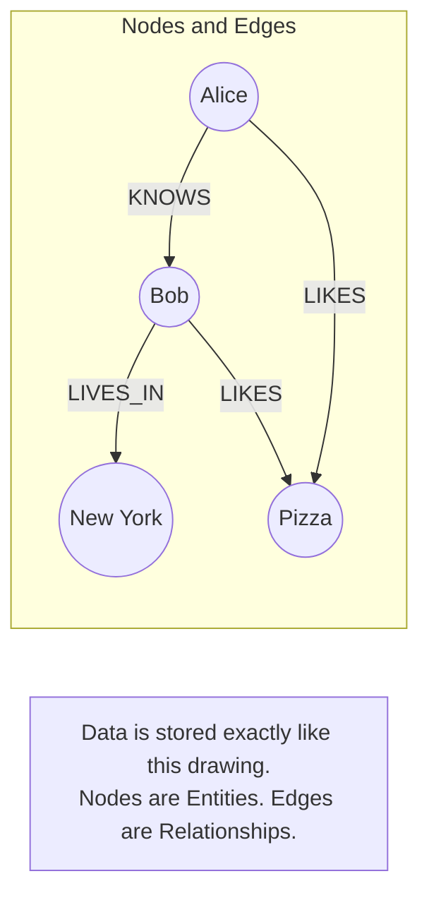

## Concept

In a standard SQL database, querying data that is highly interconnected (e.g., "Find all friends of friends of friends who live in New York and like Pizza") requires massive, complex `JOIN` tables. As the relationships get deeper, the SQL queries become exponentially slower and more computationally expensive.
**Graph Databases** treat the *relationships* between data as equally important as the data itself. They are purpose-built to traverse massive webs of interconnected data instantly.

## Mental Model

## How It Works

- **Nodes:** Represent entities (People, Cities, Products). Similar to a row in SQL.
- **Edges (Relationships):** Represent the connections between Nodes. Edges have strict directions (A -> B) and can contain properties (e.g., "KNOWS" since "2020").

**Index-Free Adjacency:**
In SQL, to find Bob's friends, the database must scan a massive `User_Friends` index table. In a true Graph Database, every Node physically stores direct memory pointers to all of its connected Nodes. To find Bob's friends, the database just follows the memory pointers instantly. Traversing a relationship is an $O(1)$ operation, regardless of how massive the database gets.

## Trade-Offs

- **Pros:** Phenomenal performance for deep relational queries (Recommendation Engines, Fraud Detection). Queries are written in specialized, readable languages (like Cypher) instead of brutal 50-line SQL JOIN's.
- **Cons:** Very poor performance for bulk analytics (e.g., "Calculate the average age of all users"). Sharding a graph database across multiple servers is incredibly difficult because relationships often span across the entire cluster, breaking the $O(1)$ pointer traversal.

## Real-World Usage

- **Neo4j:** The most famous and widely used Graph Database.
- **Amazon Neptune:** AWS's managed graph database offering.
- **Social Networks:** LinkedIn uses graph concepts to calculate "2nd-degree connections".
- **Fraud Detection:** Banks use graph databases to instantly detect if a new account shares a phone number, IP address, or physical address with a known fraudulent account network.

## Interview Questions

**Q: You are building a Recommendation Engine for an e-commerce site ("Customers who bought this also bought..."). Would you use PostgreSQL or Neo4j?**
**A:** Neo4j (a Graph Database) is significantly better suited for this. In PostgreSQL, calculating this requires a self-join on massive tables: `Users -> Orders -> Products -> Orders -> Users`. This query will likely time out if the tables have millions of rows. In Neo4j, the relationships between Users and Products are stored as direct pointers, allowing the engine to "walk" the graph and find recommendations in milliseconds.

**Q: If Graph Databases are so good at handling relationships, why do we still use Relational (SQL) databases?**
**A:** Graph databases are optimized for traversing relationships, but relational databases are optimized for structured data, transactions, and aggregation. SQL databases are a great fit when your data has a stable schema and your queries mostly involve individual records, predictable joins, or operations like SUM, AVG, and GROUP BY. For example, banking systems benefit enormously from relational databases because they need strict schemas, ACID transactions, constraints, and reliable financial calculations.

Graph databases become more attractive when the relationships themselves are the main thing you query—for example, finding friends-of-friends, recommendation paths, fraud networks, dependency graphs, or connections across many hops. So the real distinction isn't “SQL can't handle relationships.” SQL absolutely can. It's that relational databases represent relationships primarily through tables and joins, while graph databases make relationships a first-class part of the data model.

In short: use SQL when your data is structured and transactional; consider a graph database when exploring complex, interconnected relationships is central to the application.