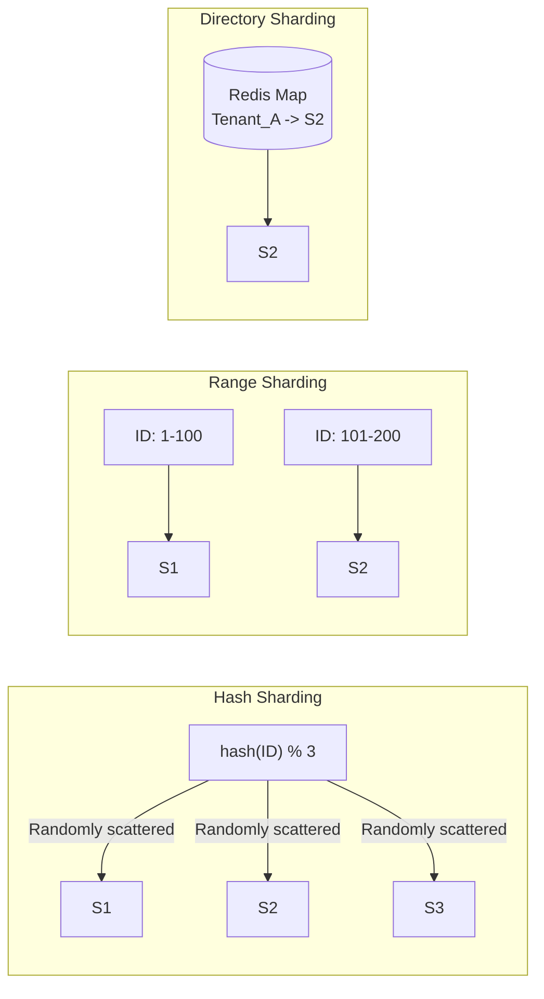

## Concept

When you shard a database, the **Routing Algorithm** you choose determines how data is distributed across the servers. Choosing the wrong strategy will lead to hotspots, data migrations nightmares, and system crashes. 

## The 3 Primary Strategies

### 1. Hash-Based Sharding
The router takes the Shard Key (e.g., `user_id`), runs it through a hash function, and uses modulo arithmetic or Consistent Hashing to pick a server.
- **Example:** `hash("alice123") % 4` -> Routes to Server 2.
- **Pros:** Guarantees perfectly even distribution of data across all servers, completely eliminating Hotspots (the Celebrity Problem).
- **Cons:** Destroys data locality. If you want to run a query to fetch the 5 newest users, those users are scattered randomly across all servers. You must query every single shard and merge the results in memory (Scatter-Gather).

### 2. Range-Based Sharding
Data is split into sequential chunks based on the value of the Shard Key.
- **Example:** Server A gets User IDs 1 to 10,000. Server B gets 10,001 to 20,000.
- **Pros:** Excellent for Range Queries. If you want to fetch Users 5,000 to 6,000, the router knows exactly which single server to query. No Scatter-Gather needed.
- **Cons:** Massive hotspotting risk, especially with sequential keys (like timestamps). If you shard by `created_at` date, Server A handles 2020, Server B handles 2021, and Server C handles 2022. Because all *new* data is generated today, Server C will receive 100% of the write traffic, while A and B sit completely idle. 

### 3. Directory-Based (Lookup) Sharding
Instead of using math, the router uses a dedicated lookup table (usually in a fast cache like Redis) to map a key to a specific server.
- **Example:** Router checks Redis: `Where is Tenant X?` -> Redis replies: `Server B`.
- **Pros:** Ultimate flexibility. You can manually move Tenant X from Server B to Server A and just update the lookup table. You don't have to change any mathematical algorithms.
- **Cons:** Introduces a Single Point of Failure and added latency. Every single database query now requires two network hops: one to the Lookup Table, and one to the actual Shard.

## Mental Model

## Interview Questions

**Q: You are building a Time-Series database to store IoT sensor temperature readings. You need to query the average temperature over the last 24 hours very quickly. Which sharding strategy do you choose?**
**A:** You should use **Range-Based Sharding**, but with a combined shard key. 
If you shard purely by timestamp, you will create a hotspot where the active shard handling "today" receives all the writes. If you shard purely by `sensor_id` (Hash), querying the last 24 hours requires a scatter-gather across all servers. 
The optimal strategy is a **Composite Shard Key**: `(sensor_id, timestamp)`. The hash of `sensor_id` ensures that writes are evenly distributed across all servers. The `timestamp` allows data for a specific sensor to be stored sequentially on disk within that shard, making range queries incredibly fast.

**Q: In Hash-Based sharding using modulo (`% N`), what happens when you add a new database server?**
**A:** This is a disaster scenario. If you have 3 servers, `hash(10) % 3` equals 1. If you add a 4th server, `hash(10) % 4` equals 2. Changing the denominator requires you to physically move almost all of your data to different servers to satisfy the new math equation. To fix this, you must use **Consistent Hashing**, which ensures that adding a server only requires moving a small fraction of the data.
