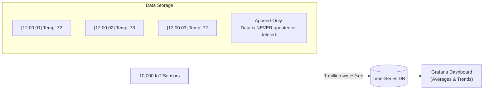

## Concept

If you are logging CPU usage every 1 second, or recording the stock price of Apple every millisecond, you generate billions of rows of data extremely fast. 
A standard SQL database will quickly choke on this write volume, and the indexes will become bloated. **Time-Series Databases (TSDB)** are specialized databases optimized specifically for high-frequency write operations, where every single row is appended with a timestamp.

## Mental Model

## How It Works

**1. Append-Only Workloads:**
In a TSDB, data is immutable. You never run `UPDATE` to fix a temperature reading from yesterday. You only `INSERT` new data at the end of the log. Because the database knows data will never be modified, it can optimize disk writes to be incredibly fast (using Log-Structured Merge-Trees instead of standard B-Trees).

**2. Extreme Compression:**
If a sensor records the temperature as 72 degrees every second for an hour, storing the number "72" 3,600 times wastes massive disk space. TSDBs use advanced delta-encoding compression. They only store the *difference* between values. If the temperature doesn't change, the DB stores almost zero bytes.

**3. Downsampling (Data Retention):**
You might need second-by-second data for the last 24 hours to debug a crash. But you don't need second-by-second data from 3 years ago. TSDBs have built-in background workers that automatically "downsample" old data—taking the average of 60 seconds of data, storing it as a single 1-minute data point, and deleting the granular data to save disk space.

## Trade-Offs

- **Pros:** Capable of ingesting millions of writes per second on cheap hardware. Built-in analytical functions (e.g., calculating moving averages).
- **Cons:** Terrible for random reads. You cannot query `WHERE temperature = 72`. You MUST query based on time: `WHERE time > NOW() - 1h`. They are not suitable for standard transactional data (like user accounts).

## Real-World Usage

- **InfluxDB / Prometheus:** The industry standards for application monitoring and DevOps metrics (CPU, RAM, API error rates). Usually paired with Grafana for visualization.
- **TimescaleDB:** A powerful TSDB built entirely as an extension on top of PostgreSQL, allowing you to use standard SQL while getting time-series performance.
- **Financial Markets:** High-frequency trading firms use highly proprietary TSDBs (like kdb+) to store tick-by-tick stock market data.

## Interview Questions

**Q: Why shouldn't you use MongoDB or PostgreSQL for storing application metrics (like CPU usage every second)?**
**A:** While you *can*, it becomes an operational nightmare at scale. Standard databases build indexes to make random reads fast, but updating those indexes on every single write slows down the system. With millions of metrics arriving per second, the indexes will swell to larger than the available RAM, causing the database to thrash the hard drive and crash. TSDBs use specialized structures (like LSM trees) to defer indexing and optimize purely for write-throughput.

**Q: What is Downsampling?**
**A:** Downsampling is the process of aggregating high-resolution time-series data into lower-resolution data over time. For example, keeping 1-second resolution data for the last 7 days, but aggregating it into 1-hour averages for data older than 7 days, and 1-day averages for data older than a month. This prevents infinite disk space growth while still allowing long-term trend analysis.
