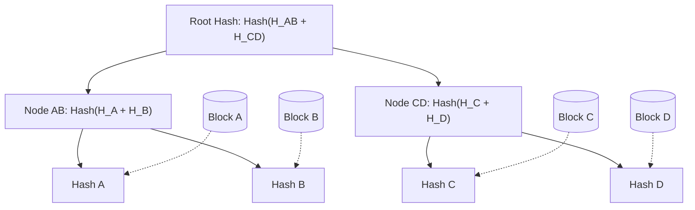

## Concept

In distributed systems, data is copied across many servers. If Amazon DynamoDB replicates a database across three continents, how does it quickly verify that all three copies are perfectly identical? 
Comparing 1 Terabyte of raw data over the network to see if a single byte was corrupted would take days.
A **Merkle Tree** (Hash Tree) is a data structure that allows systems to quickly and efficiently verify the integrity of massive datasets and instantly pinpoint the exact location of any corrupted data.

## Mental Model

A Merkle Tree is a binary tree where the "leaves" are the hashes of the actual data blocks, and every "parent" node is a hash of its two children.

## How It Works: The Anti-Entropy Process

Imagine Server 1 and Server 2 both hold 1TB of the same data. They want to check if they are synchronized.

1. **The Root Check:** Server 1 sends its Top Root Hash (`a1b2...`) to Server 2. Server 2 compares it to its own Root Hash. 
   - If they match exactly, the 1TB of data is 100% identical. The process is over. It took 1 millisecond and 32 bytes of network bandwidth.
   - If they do NOT match, some data is corrupted.
2. **The Descent:** They look at the two child nodes. Server 1 sends the hashes of the Left and Right branches.
   - The Left branch hashes match. The corruption is not there.
   - The Right branch hashes do NOT match. The corruption must be on the Right side.
3. **The Pinpoint:** They continue walking down the Right side of the tree, comparing hashes at each level, eliminating half the tree with every step ($O(\log N)$).
4. **The Resolution:** Within 20 network hops, they reach the exact bottom leaf node. They discover that "Block D" (a 1 MB file) is corrupted. Server 1 simply sends the correct 1 MB "Block D" over the network, repairing the 1TB database instantly.

## Real-World Usage

- **Cassandra & DynamoDB:** Used heavily in their "Anti-Entropy" repair processes. Background workers constantly build Merkle trees of the database rows and compare them with neighbor nodes to silently fix corrupted or missed replicated data.
- **Git:** Git uses a Merkle-like structure (Directed Acyclic Graph of hashes). Every commit is a hash of the tree, allowing Git to instantly know if a massive codebase was altered.
- **Blockchain / Bitcoin:** Every block in a blockchain contains a Merkle Root Hash of all the thousands of transactions inside that block. This allows a "Lightweight Mobile Wallet" to verify that a specific transaction happened without downloading the entire 500GB blockchain.

## Interview Questions

**Q: Why doesn't a database just use a single, massive hash function for the entire 1 Terabyte of data instead of building a complex tree?**
**A:** A single massive hash (like SHA-256) would certainly prove if the data was corrupted. However, if the hashes don't match, you have absolutely no idea *where* the corruption is. The only way to fix it would be to transmit the entire 1 Terabyte of data over the network to overwrite it. A Merkle Tree provides **spatial awareness**, allowing you to drill down and isolate the corruption to a single 1 Megabyte block, saving massive network bandwidth during repairs.
