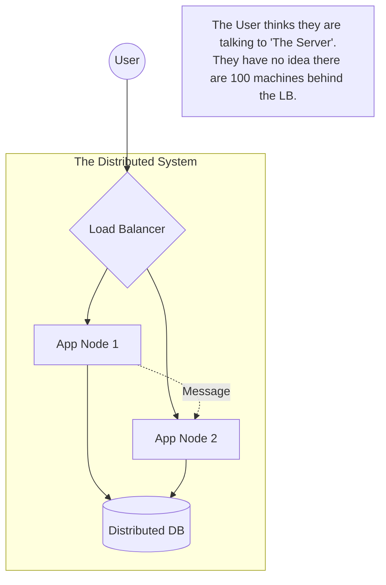

## Concept

A **Distributed System** is a network of independent computers that communicate and coordinate their actions by passing messages to one another, appearing to the end-user as a single, unified computer.
Why do we build them? Because physical hardware has limits. You cannot buy a single computer powerful enough to host all of Google. You must use millions of smaller computers working together.

## Mental Model

## The Fallacies of Distributed Computing

When transitioning from monolithic to distributed systems, developers make fatal assumptions. Peter Deutsch documented the "8 Fallacies of Distributed Computing":

1. **The network is reliable.** (It is not. Cables get cut, routers crash. You must build retries).
2. **Latency is zero.** (It is not. A local function call takes 1 nanosecond. An API call to another server takes 50,000,000 nanoseconds).
3. **Bandwidth is infinite.** (It is not. Sending massive JSON payloads between microservices will saturate your network cards).
4. **The network is secure.** (It is not. Data must be encrypted in transit).
5. **Topology doesn't change.** (Servers are constantly scaling up, dying, and changing IP addresses).
6. **There is one administrator.** (In cloud environments, you don't control the underlying hardware).
7. **Transport cost is zero.** (Network traffic, especially across AWS availability zones, costs massive amounts of money).
8. **The network is homogeneous.** (Every server has different hardware, operating systems, and speeds).

## Trade-Offs

- **Pros:** **Infinite Horizontal Scalability**. High Availability (if one node dies, the others take over). Fault Tolerance.
- **Cons:** **Exponential Complexity**. Debugging is a nightmare (a bug might only happen when 3 specific servers out of 100 interact in a specific order). Keeping data perfectly synchronized across all nodes is mathematically impossible without sacrificing uptime (CAP Theorem).

## Real-World Usage

Almost everything in the modern cloud is a distributed system.
- **Microservices:** A single HTTP request to Netflix might trigger internal network calls to 50 different downstream services before returning a video.
- **Blockchain:** The ultimate distributed system, where nodes don't even trust each other (Byzantine Fault Tolerance).

## Interview Questions

**Q: In a distributed system, how do you debug an error when a single user request spans across an API Gateway, an Auth Service, an Order Service, and a Database?**
**A:** You absolutely must implement **Distributed Tracing** (e.g., using OpenTelemetry, Jaeger, or DataDog). When the user's request hits the API Gateway, the gateway generates a unique `trace_id` and attaches it to the HTTP headers. Every downstream microservice must extract this `trace_id` and include it in its own logs. When the Order Service crashes, you can query your centralized logging system (Elasticsearch) for that exact `trace_id` to see the entire lifecycle and latency of the request across all 4 servers.
