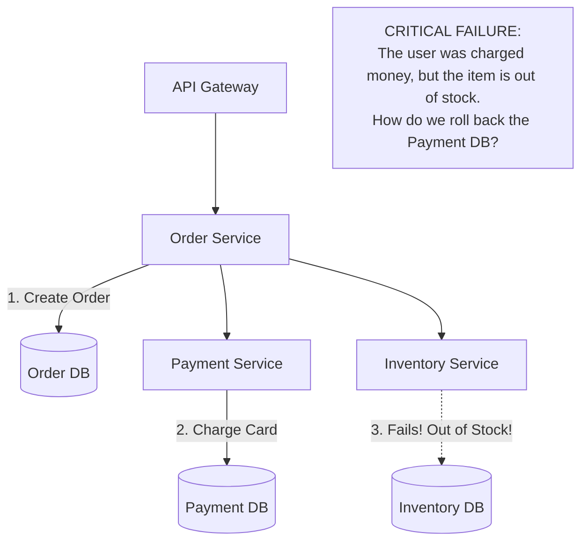

## Concept

In a monolithic application with a single PostgreSQL database, wrapping multiple SQL statements in `BEGIN` and `COMMIT` guarantees strict ACID consistency.
But what happens in a Microservices architecture? If a user buys an item, the Order Service must write to the `Orders_DB`, the Payment Service must write to the `Payments_DB`, and the Inventory Service must write to the `Inventory_DB`. How do you guarantee that either *all three* databases update successfully, or *none* of them do, even if the network crashes halfway through?

## Mental Model: The Distributed Problem

## The Solutions

There are two primary patterns to solve Distributed Transactions:

### 1. Two-Phase Commit (2PC)
A strict, synchronous protocol that uses a central Coordinator to guarantee absolute ACID consistency across all databases. (Covered deeply in the next chapter).
- **Pros:** Perfect consistency.
- **Cons:** Incredibly slow. Locks database rows across all services simultaneously. Creates a massive single point of failure. Highly discouraged in modern microservices.

### 2. The Saga Pattern (Industry Standard)
Instead of trying to achieve synchronous ACID compliance, the Saga pattern embraces **Eventual Consistency** (BASE). A Saga is a sequence of local transactions. Each service updates its own database and immediately publishes an asynchronous Event (via Kafka/RabbitMQ) to trigger the next service in the chain.

**Compensating Transactions (The Undo Button):**
If a service fails (e.g., Inventory is out of stock), it publishes a "Failure Event". The Saga reverses direction. The previous services catch this failure event and execute a **Compensating Transaction**—custom code specifically written to reverse their previous action (e.g., the Payment Service issues a refund).

**Two ways to coordinate a Saga:**
1. **Choreography (Decentralized):** Services listen to each other's events directly. Great for simple workflows (2-3 services). Becomes a tangled mess of spaghetti events in complex systems.
2. **Orchestration (Centralized):** A dedicated "Saga Orchestrator" service acts as a state machine. It tells the Payment service "Charge the card". Payment replies "Done". Orchestrator then tells Inventory "Reserve item". If Inventory fails, Orchestrator tells Payment "Issue refund". (Preferred for complex workflows).

## Trade-Offs of the Saga Pattern

- **Pros:** Massive scalability and throughput. No distributed locks blocking the databases.
- **Cons:** Exponentially increases code complexity. You must write "Undo" logic for every single action. 
- **The "Lack of Isolation" Problem:** Because the Saga executes over several seconds, a user might check their account balance exactly between the "Charge Card" step and the "Refund" step. They will see inaccurate, intermediate data.

## Interview Questions

**Q: You are building the core financial ledger for a bank. Transfers between accounts span multiple microservices. Do you use the Saga pattern or Two-Phase Commit (2PC)?**
**A:** This is the rare case where **2PC** (or moving back to a Monolith) is absolutely required. The Saga pattern fundamentally lacks **Isolation**. During a Saga, money might be deducted from Account A, and there is a 5-second delay before it is added to Account B. If the system calculates total bank assets during those 5 seconds, the money simply doesn't exist. Financial systems usually cannot tolerate Eventual Consistency and require strict, synchronous ACID locks across the entire cluster.

**Q: What is the Outbox Pattern and why is it essential for Sagas?**
**A:** In a Saga, a service must update its database AND publish an event to Kafka. If the database updates, but the network crashes before sending the Kafka event, the Saga halts and the system is permanently corrupted. 
The **Outbox Pattern** solves this. Instead of sending the Kafka event directly, the service writes the event into an "Outbox" table *inside the same database*, within the same local ACID transaction as the data update. A separate background worker constantly reads the Outbox table and reliably forwards the messages to Kafka.
