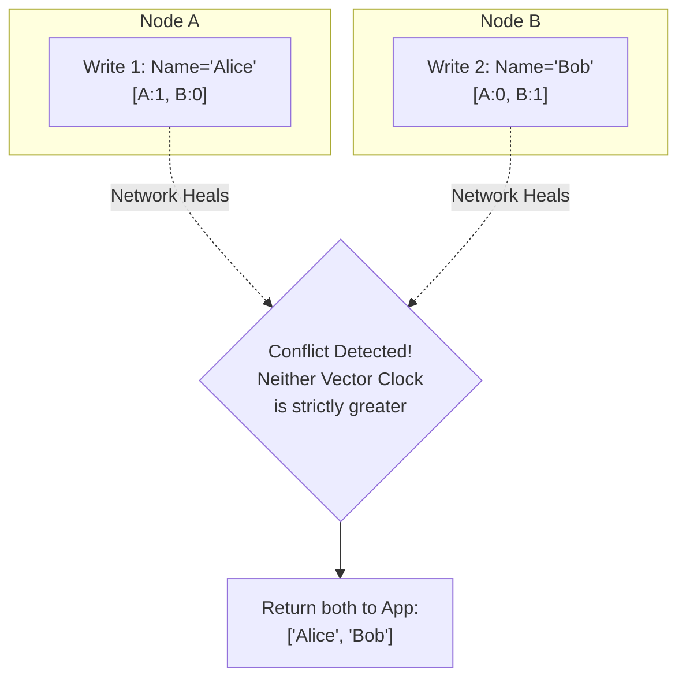

## Concept

In distributed architectures, **Eventual Consistency** is often the default choice to achieve high availability and low latency (as dictated by the CAP and PACELC theorems). However, "eventually" is a dangerous word. It implies that for a brief window of time, the system is actively inconsistent. Handling this state requires specific design patterns.

## The Core Challenge: Conflict Resolution

If Node A and Node B are temporarily disconnected (a network partition), and two different users update the exact same record on both nodes simultaneously, both nodes will accept the write (to maintain Availability). 
When the network heals, Node A and Node B sync up and realize they have completely different data for the same record. The system must automatically resolve this conflict.

### Resolution Strategy 1: Last Write Wins (LWW)
- **How it works:** Every write is tagged with a timestamp from the server's local clock. When resolving a conflict, the database simply deletes the older record and keeps the newer one.
- **The Danger:** Server clocks are never perfectly synchronized (Clock Drift). If Node A's internal clock is accidentally 5 seconds faster than Node B's clock, Node A's writes will unjustly overwrite Node B's writes, resulting in silent data loss. This is the default in databases like Cassandra.

### Resolution Strategy 2: Application-Level Resolution
- **How it works:** The database refuses to guess. When the nodes sync, the database stores *both* versions of the data (creating a sibling conflict). The next time the application queries that record, the DB returns both versions. The application code (the developers) must provide the logic to merge them.
- **Example:** DynamoDB and Riak use **Vector Clocks** to detect these conflicts and surface them to the application layer.

### Resolution Strategy 3: CRDTs (Conflict-Free Replicated Data Types)
- **How it works:** A complex mathematical data structure specifically designed so that updates can be applied in any order, on any node, and they will mathematically always converge to the exact same final state without any developer intervention.
- **Example:** A "Grow-Only Counter". If Node A increments a 'Like' button, and Node B increments it, the CRDT guarantees the final count will be accurate regardless of when the nodes sync. Used heavily in Redis Enterprise and collaborative text editors (Figma, Google Docs).

## Mental Model: Vector Clocks

## Interview Questions

**Q: What is a Vector Clock?**
**A:** A Vector Clock is an array of counters attached to a piece of data. Instead of using highly unreliable server timestamps (which suffer from clock drift), the database tracks causality. If a piece of data has a clock of `[NodeA: 2, NodeB: 1]`, and a new update arrives with a clock of `[NodeA: 2, NodeB: 2]`, the system mathematically knows the new update happened *after* the previous one, and can safely overwrite it without relying on actual time. If the clocks diverge (e.g., `[A:3, B:1]` vs `[A:2, B:2]`), a concurrent conflict has occurred.

**Q: You are building the Amazon Shopping Cart using an AP (Available/Partition Tolerant) database. The user is logged into their phone (hitting Node A) and their laptop (hitting Node B). They add "Shoes" on the phone, and "Socks" on the laptop. A network partition occurs. When the network heals, how should the database resolve the conflict?**
**A:** We absolutely cannot use **Last Write Wins (LWW)** here. If we do, whichever item was added a millisecond later will overwrite and delete the other item from the cart, causing lost sales. 
Instead, we must use **Application-Level Resolution**. The database should keep both shopping carts. When the nodes sync, the application code should execute a simple `Set Union` operation, mathematically combining the contents so the final cart contains `["Shoes", "Socks"]`.
