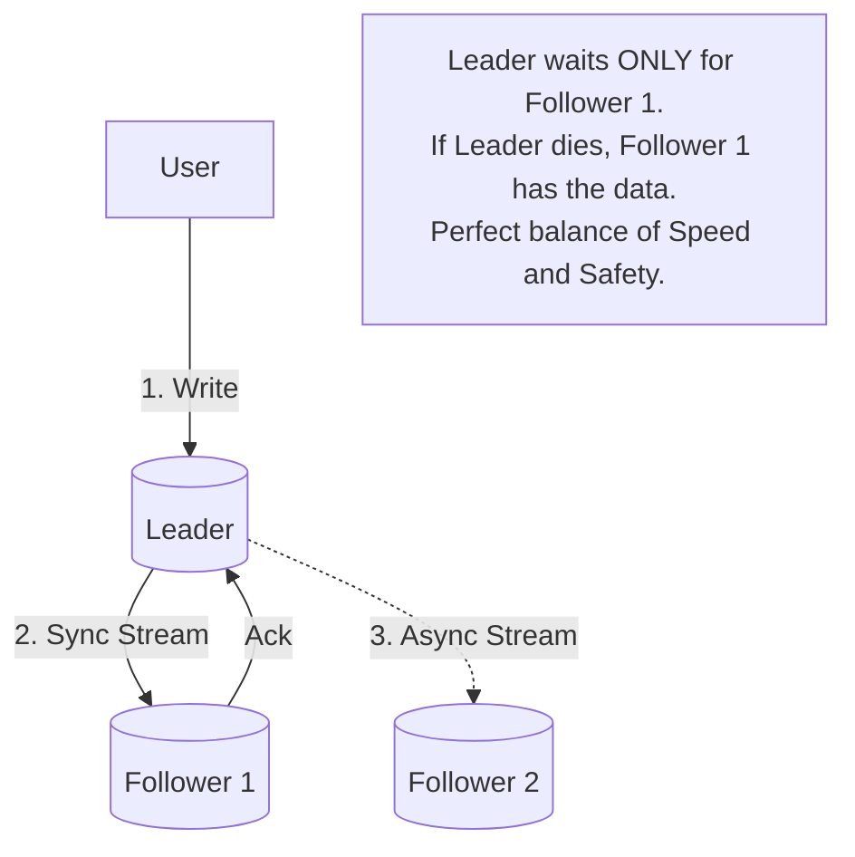

## Concept

In **Leader-Follower** (historically called Master-Slave) architecture, one specific node is designated as the absolute source of truth. All data modifications (`INSERT`, `UPDATE`, `DELETE`) must go strictly through this single Leader. The Leader is responsible for streaming the changes to all of its Follower nodes.

## The Replication Log

How does the Leader actually send data to the Followers?

1. **Statement-Based Replication:** 
   - The Leader literally sends the exact SQL statement (`INSERT INTO users...`) to the Followers, and the Followers execute the SQL locally.
   - **Fatal Flaw:** If the SQL statement contains non-deterministic functions like `NOW()` or `RAND()`, the Leader and Followers will generate completely different data, permanently corrupting the replicas.
   
2. **Write-Ahead Log (WAL) Shipping:**
   - The Leader sends its raw, low-level binary disk log to the Followers. The Followers blindly copy the exact bytes to their own hard drives.
   - **Fatal Flaw:** It is deeply tied to the specific storage engine. If the Leader is upgraded to PostgreSQL v14, but the Follower is still on PostgreSQL v13, the raw byte format might be different, causing a crash. You cannot do zero-downtime version upgrades.

3. **Logical (Row-Based) Replication:**
   - The modern standard. The Leader translates the write into an engine-independent logical format (e.g., "Row ID 5 in Table 'Users' was updated to have Name='Alice'"). The Followers apply this specific row update.
   - **Pros:** Completely safe from non-deterministic functions, and allows replicating data between different database versions or entirely different systems (like streaming data from PostgreSQL to Elasticsearch).

## Synchronous vs Asynchronous Replication

- **Synchronous:** The Leader sends the data to the Followers and physically blocks the user's HTTP request, waiting for the Followers to say "I saved it" before replying to the user.
  - **Pro:** Zero data loss. Perfect durability.
  - **Con:** If one Follower has a bad network cable, the entire system halts and becomes completely unavailable.
  
- **Asynchronous (The Default):** The Leader saves the data locally, instantly replies "Success!" to the user, and sends the data to the Followers in the background.
  - **Pro:** Lightning fast. The system doesn't care if a Follower is slow or dead.
  - **Con:** **Replication Lag.** If the Leader dies before the background sync finishes, data is permanently lost.

## Mental Model: Semi-Synchronous

## Real-World Usage

Almost all relational databases (PostgreSQL, MySQL) default to Asynchronous Leader-Follower replication. To achieve high safety without the crushing performance penalty of full Synchronous replication, systems use **Semi-Synchronous Replication**. 
The Leader streams the data to 5 Followers, but only waits for *one single Follower* to acknowledge the save. As long as one Follower confirms receipt, the Leader responds to the user. This guarantees that if the Leader dies, there is at least one exact up-to-date copy of the data available to take over.

## Interview Questions

**Q: You are using Asynchronous Replication. A user updates their profile and the page refreshes. The application reads from a Follower node to render the page, but the old data is still there due to Replication Lag. How do you fix this terrible User Experience?**
**A:** You implement **Read-After-Write Consistency**. The application layer tracks when a user modifies their own data (e.g., storing a timestamp in the user's session cookie). For the next 5 seconds after a modification, the application code forces all of that specific user's Read queries to go directly to the **Leader** node instead of a Follower. Other users will still read from Followers (eventual consistency), but the modifying user will always see their own updates instantly.

**Q: How does a Follower node catch up if it crashes and is offline for 2 hours?**
**A:** When the Follower boots back up, it looks at its own internal log to find the exact Log Sequence Number (LSN) or transaction ID of the last write it successfully processed before crashing. It connects to the Leader and says, "Please stream all changes that occurred *after* LSN 1000." The Leader keeps a backlog of recent changes in its replication buffer specifically for this scenario.
