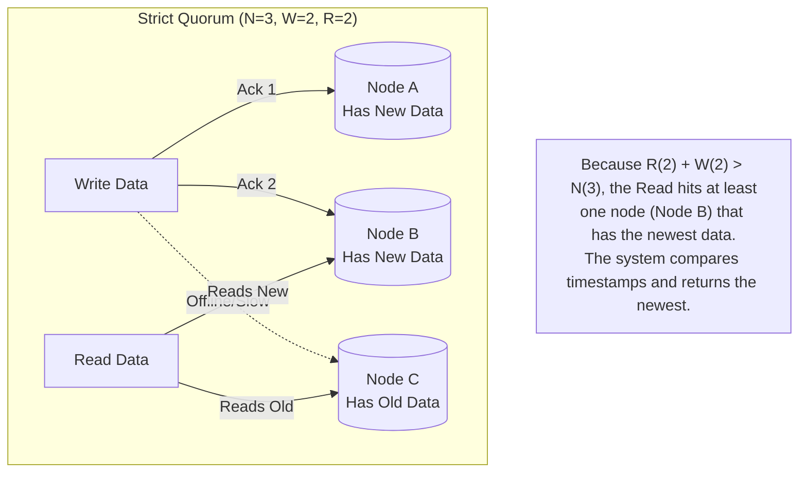

## Concept

In distributed databases (especially Leaderless architectures like Cassandra or DynamoDB), data is replicated across multiple nodes (e.g., 3 nodes). When a user reads or writes data, does the system have to wait for all 3 nodes to reply? 
If it waits for all 3, the system is slow and fragile (if 1 node is rebooting, the write fails). If it only waits for 1, the system is fast but risks returning stale data.
A **Quorum** is the minimum number of nodes that must successfully acknowledge a read or write operation for it to be considered successful.

## The Quorum Formula

To guarantee that a Read operation will *always* see the most recent Write operation, you must follow this mathematical rule:

$$ R + W > N $$

- **$N$**: Total number of replicas (nodes) storing the data.
- **$W$**: Write Quorum (number of nodes that must acknowledge a Write).
- **$R$**: Read Quorum (number of nodes that must acknowledge a Read).

As long as $R + W$ is strictly greater than $N$, there will always be an overlap. At least one node in the Read quorum is mathematically guaranteed to be a node that participated in the previous Write quorum, ensuring you get the freshest data.

## Mental Model

## Trade-Offs

You can tune $R$ and $W$ to optimize your database for different workloads:

1. **Balanced (W=2, R=2, N=3)**
   - The standard default. Good write speed, good read speed. Tolerates 1 node failure.
   
2. **Fast Writes (W=1, R=3, N=3)**
   - The database only waits for 1 node to acknowledge the write. Lightning fast writes!
   - But to guarantee consistency, every Read operation must query *all 3 nodes*. Reads are very slow and fragile (if 1 node is offline, you cannot read).
   - Use Case: Heavy data logging where reads are rare.
   
3. **Fast Reads (W=3, R=1, N=3)**
   - The database writes to all 3 nodes. Writes are slow.
   - A Read operation only has to query 1 single node. Lightning fast reads!
   - Use Case: Heavy read systems (like a User Profile configuration database).

## Sloppy Quorums and Hinted Handoff

What happens if $W=2$, but 2 of your 3 nodes are completely dead? The database cannot reach quorum, and it completely rejects the user's write request (loss of Availability).

To fix this, systems like DynamoDB introduced the **Sloppy Quorum**.
If Node A and B are dead, the system will temporarily accept the write on Node C, and *also* write it to a completely random Node D that doesn't usually hold this data. Node D holds the data in a temporary "hinted handoff" state. When Node A and B come back online, Node D hands the data back to them. This ensures massive availability, but sacrifices strict consistency guarantees.

## Interview Questions

**Q: Your database has a replication factor of $N=5$. You want extremely fast writes, so you set $W=1$. What must you set $R$ to in order to guarantee you never read stale data?**
**A:** Using the formula $R + W > N$: 
$R + 1 > 5$. Therefore, $R$ must be **5**. 
Every single read operation must wait for a response from all 5 nodes. This will cause horrific read latency and means if even a single node is rebooting, all reads will fail.

**Q: Explain how Quorums solve the "Split Brain" problem.**
**A:** Split brain occurs when a network partition cuts a cluster in half. If you have a 5-node cluster, it might split into a group of 3 and a group of 2. If $W=3$ (a majority quorum), the group of 2 will completely reject all writes because they cannot reach the required 3 nodes. Only the group of 3 will accept writes. This mathematically guarantees that it is impossible for both sides of the network split to independently accept conflicting writes.
