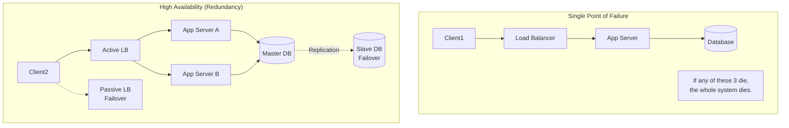

## Concept

Availability is the percentage of time a system remains operational and responsive to user requests under normal conditions. It is usually quantified in "nines". A system is highly available if it eliminates Single Points of Failure (SPOF) through redundancy.

## Mental Model: The Nines

| Availability % | Downtime per year | System Type |
| :--- | :--- | :--- |
| 99% ("Two nines") | ~3.65 days | Basic startup, internal tools. |
| 99.9% ("Three nines") | ~8.77 hours | Standard e-commerce, SaaS. |
| 99.99% ("Four nines") | ~52.6 minutes | Enterprise-grade, core APIs. |
| 99.999% ("Five nines") | ~5.26 minutes | Telecom, banking, AWS S3. |

## Architecture Diagram

## Trade-Offs

To achieve High Availability (HA), you must introduce **Redundancy**.
- **Pros:** The system survives hardware failures, network partitions, and software crashes. You can perform zero-downtime deployments.
- **Cons:** 
  - **Cost:** You are paying for servers that might just sit idle (passive failovers).
  - **Complexity:** Keeping redundant databases synchronized (replication) introduces severe complexity and consistency issues.

## Real-World Usage

- **Active-Passive (Hot Standby):** You have a Load Balancer that routes all traffic to Server A. Server B sits doing absolutely nothing. A heartbeat monitoring system (like Keepalived) watches Server A. If A dies, the IP address instantly swaps to Server B. This is cheap to reason about, but wastes hardware.
- **Active-Active:** Both Server A and Server B handle traffic simultaneously. If A dies, B just takes the full load. This is much better, but requires stateless application architecture.

## Interview Questions

**Q: A system has two components in series: a Load Balancer (99% available) and an App Server (99% available). What is the total system availability?**
**A:** In a series system (where both must work for the system to work), you multiply the probabilities. 
`0.99 * 0.99 = 0.9801` (98.01%). 
*Notice that adding components in series DECREASES overall availability!*

**Q: How do you increase availability if components are in series?**
**A:** You put them in **parallel** (redundancy). If you have two App Servers running in parallel, both would have to fail simultaneously to cause an outage. The probability of both failing is `(1 - 0.99) * (1 - 0.99) = 0.0001`. Therefore, the availability of the parallel app tier is `99.99%`.

**Q: How do you eliminate a Load Balancer as a Single Point of Failure?**
**A:** A load balancer is software running on hardware. It can die. To fix this, you run multiple Load Balancers and use DNS Round Robin to distribute traffic among them. However, DNS caching can be problematic. The enterprise standard is using BGP (Border Gateway Protocol) and Anycast routing at the network level, or relying on Cloud Providers (AWS ALB) which abstract the redundancy away from you entirely.
