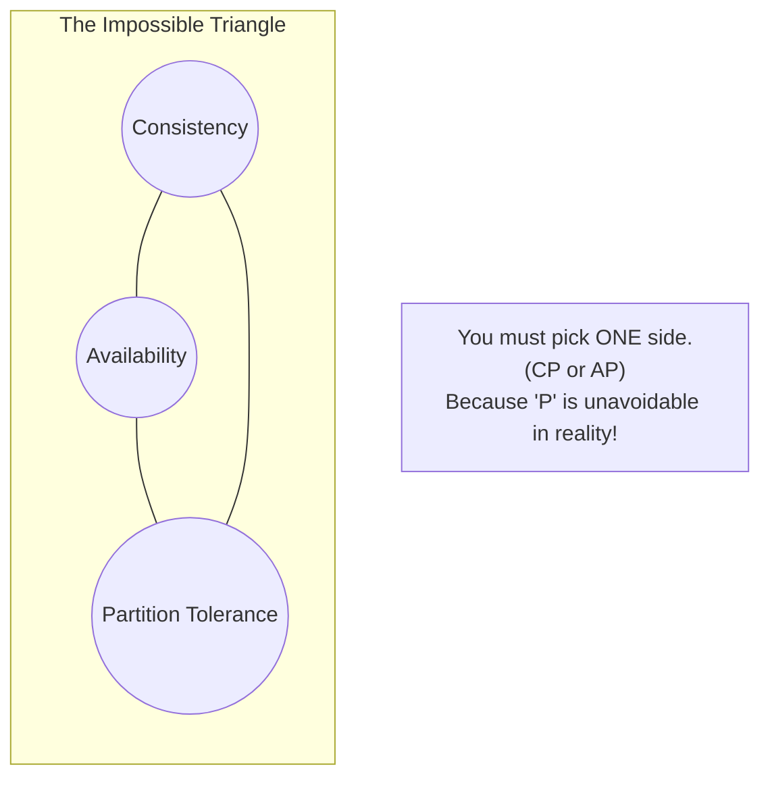

## Concept

The **CAP Theorem** states that any distributed data store can only provide two of the following three guarantees simultaneously:
- **C**onsistency: Every read receives the most recent write or an error. All nodes see the exact same data at the same time.
- **A**vailability: Every request receives a non-error response, without the guarantee that it contains the most recent write. The system stays up.
- **P**artition Tolerance: The system continues to operate despite an arbitrary number of messages being dropped or delayed by the network between nodes.

## Mental Model: The Triangle

## Trade-Offs

**The Reality of 'P':**
In a distributed system (nodes connected over the internet or a local network), networks *will* fail. A network partition (connection loss between Node A and Node B) is guaranteed to happen eventually. Therefore, **Partition Tolerance is not optional; you must build for it.**
Because 'P' is mandatory, the CAP theorem effectively states: *When a network partition occurs, you must choose between Consistency or Availability.*

**1. CP (Consistency + Partition Tolerance):**
- **What happens during a network break:** Node A cannot talk to Node B. If a user writes to Node A, Node A refuses the write and returns an error. It sacrifices Availability to guarantee that Node A and Node B never hold conflicting data.
- **Use Case:** Banking systems, financial ledgers.

**2. AP (Availability + Partition Tolerance):**
- **What happens during a network break:** Node A cannot talk to Node B. If a user writes to Node A, Node A accepts the write. It sacrifices Consistency, allowing Node A and Node B to hold completely different data temporarily. They will sync up later when the network heals (Eventual Consistency).
- **Use Case:** Social media feeds, e-commerce shopping carts.

**3. CA (Consistency + Availability):**
- **What happens during a network break:** The system crashes. 
- **Use Case:** A single-node monolithic database (like a standard PostgreSQL server). It is strictly not a distributed system.

## Real-World Usage

- **CP Databases:** MongoDB, HBase, Redis (in Sentinel/Cluster mode). They prefer to shut down or elect a new master rather than serve split-brain data.
- **AP Databases:** Cassandra, DynamoDB, Riak. They are designed for massive uptime and will happily accept writes on both sides of a network split, relying on conflict resolution later.

## Interview Questions

**Q: In the CAP theorem, does "Consistency" mean the same thing as the "C" in ACID databases?**
**A:** **No!** This is a very common trap.
- The 'C' in **ACID** (Database Consistency) means the data follows the rules you defined (e.g., a foreign key must exist, balance cannot be negative).
- The 'C' in **CAP** (Distributed Consistency) means every node in the cluster holds the exact same data at the exact same millisecond. It is about data replication, not business rules.

**Q: Why would an e-commerce site like Amazon choose an AP datastore for their Shopping Cart?**
**A:** If Amazon's database nodes lose connection, choosing Consistency (CP) means users cannot add items to their cart. This directly costs Amazon millions of dollars in lost sales. Choosing Availability (AP) means the user can keep shopping on an isolated node. When the network heals, Amazon will merge the carts together. They would rather deal with a slightly confusing cart merge later than prevent a user from buying right now.
