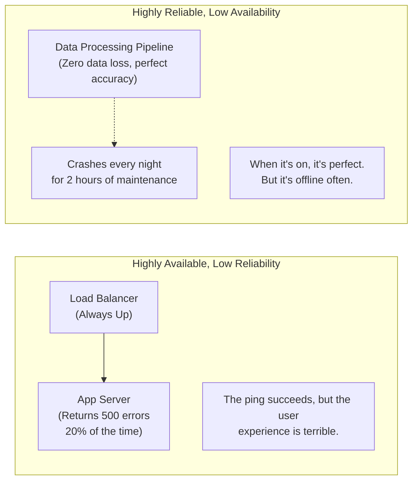

## Concept

Many people use Reliability and Availability interchangeably, but they mean different things.
- **Availability:** Is the system currently up and accepting requests? (Uptime).
- **Reliability:** When the system accepts a request, does it do the *correct* thing without failing or dropping data?

## Mental Model

## Trade-Offs

- A system can be **100% available** but completely unreliable if it constantly serves stale data, drops messages, or returns HTTP 500 errors to 1 out of every 10 users.
- A system can be **100% reliable** (never drops a single transaction, perfectly guarantees ACID compliance) but have poor availability because it takes itself offline during network partitions to protect data integrity (see the CAP theorem).

## Real-World Usage

- **E-Commerce Checkout:** Must be Highly Reliable. If a user clicks "Pay", the system absolutely cannot drop that transaction, charge them twice, or lose the order. We will sacrifice availability (show a "Site Maintenance" page) rather than risk financial corruption.
- **Twitter Feed:** Must be Highly Available. If a user refreshes their timeline, they expect to see tweets instantly. If the system drops a single tweet (low reliability), the user won't even notice. We prioritize keeping the site online over guaranteeing perfect data delivery.

## Interview Questions

**Q: How do you measure Reliability vs Availability?**
**A:** Availability is measured in uptime (the "Nines", e.g., 99.9% uptime over a month). Reliability is usually measured by calculating the MTBF (Mean Time Between Failures) and the error rate (e.g., "99.99% of requests resulted in an HTTP 200 OK"). 

**Q: If your database fails, you have an aggressive retry mechanism with exponential backoff that eventually succeeds after 45 seconds. Did you impact reliability or availability?**
**A:** You preserved Reliability (the data was eventually written and not lost), but you heavily degraded Availability from the user's perspective (a 45-second delay is effectively downtime for a web user).
