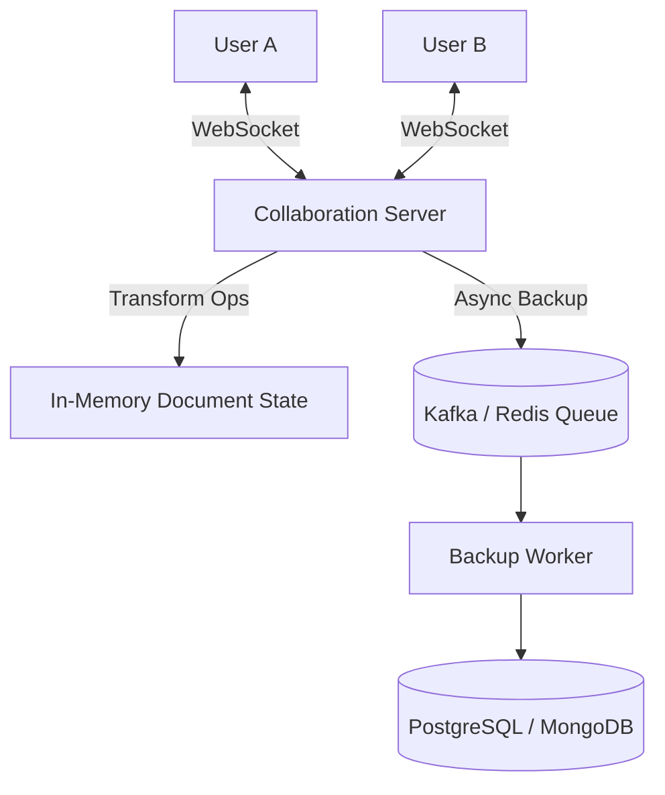

## Concept

**The Problem:** Design a collaborative text editor where 10 users can type on the exact same document at the exact same millisecond. They must all see each other's changes instantly, and their edits cannot overwrite or corrupt each other.

This question tests your knowledge of **WebSockets** and advanced conflict resolution algorithms, specifically **Operational Transformation (OT)** or **CRDTs**.

## 1. The Core Challenge: Concurrent Edits

The document contains the word `CAT`.
- User A deletes `C`. (Wants document to be `AT`).
- User B adds `S` at the end. (Wants document to be `CATS`).

Because of network latency (100ms), they execute these actions at the exact same time before seeing the other person's changes.
If the Server receives User A's delete command, it executes it. The document is `AT`.
When the Server receives User B's command ("Insert S at index 3"), it crashes, because index 3 no longer exists (the document is only 2 letters long now). 
Traditional locking (Pessimistic Locking) is impossible; you cannot lock a document every time someone types a single letter, the latency would make typing impossible.

## 2. The Solution: Operational Transformation (OT)

This is the algorithm Google Docs uses. It mathematically transforms incoming operations based on concurrent operations that happened in the past.

1. **The Operations:** Every keystroke is an operation: `Insert(char, index)` or `Delete(index)`.
2. **The Server as the Source of Truth:** The central Node.js server holds the master copy of the document and an ordered log of every operation ever applied.
3. **The Transformation:** When the Server receives User B's command (`Insert 'S' at index 3`), it realizes User B was acting on stale data. The Server looks at User A's command (`Delete index 0`) which was just processed. 
   The Server runs a Transformation Algorithm: *Since a character was deleted before index 3, the target index shifts left by 1.* 
   The Server transforms User B's command into `Insert 'S' at index 2`. It applies the transformed command safely. The document becomes `ATS`.

*Note: CRDTs (Conflict-free Replicated Data Types) are the modern, decentralized alternative to OT (used by Figma and Automerge), but OT remains the standard answer for Google Docs.*

## 3. High-Level Architecture

## 4. The Data Flow

1. **Connection:** User A opens a document. Their browser opens a persistent **WebSocket** to the Collaboration Server.
2. **Typing:** User A types "Hello". The browser batches the keystrokes and sends an Operation over the WebSocket.
3. **Processing:** The Server receives the Operation, applies Operational Transformation (OT) against the in-memory state, updates the memory, and broadcasts the transformed operation to User B's WebSocket.
4. **Storage:** Updating PostgreSQL every single keystroke will destroy the database. The Server pushes the operation to a Kafka queue. A background worker pulls operations from Kafka and saves snapshots of the document to the database every 10 seconds.

## 5. Scaling the Collaboration Servers

WebSockets are stateful. If 10 people are editing Document #123, they **must** all be connected to the exact same physical Node.js server to run the OT algorithm in RAM.

**How do we route them?**
We use a **Session Service (Redis)**.
When User A requests to open Doc #123, the API Gateway checks Redis. 
- If Doc #123 is not active, the Gateway assigns it to `Server 5`, saves `Doc_123 -> Server_5` in Redis, and routes the WebSocket.
- When User B opens Doc #123, the Gateway checks Redis, sees it is assigned to `Server 5`, and routes User B's WebSocket directly to `Server 5`.

## Interview Questions

**Q: A user goes into a tunnel and loses internet connection for 5 minutes. They continue typing an entire paragraph offline. When they reconnect, how does the system merge 5 minutes of offline edits without destroying the document?**
**A:** The client's browser maintains an internal queue of "Pending Operations". While offline, every keystroke is saved to this local queue. When the internet reconnects, the client flushes the entire queue to the server. The server's OT algorithm is designed precisely for this. It takes the client's massive chunk of operations, looks at the master log of everything that happened in the last 5 minutes, transforms the client's operations against that massive history, and applies them. (This might result in formatting weirdness, but it guarantees no data is physically corrupted).

**Q: Google Docs keeps a full "Version History" allowing you to restore the document to how it looked 3 weeks ago. How is this stored efficiently?**
**A:** You do not save a massive 1MB text blob to the database every 10 seconds. You use **Event Sourcing**. The database stores an immutable, append-only log of every single Operation (keystroke) that ever occurred. 
To view the document as it looked 3 weeks ago, the server loads the blank document and simply replays the event log from the beginning of time until it hits the timestamp from 3 weeks ago. To optimize the massive replay time, the system periodically saves full "Snapshots" of the document state every 10,000 operations, so it only has to replay operations that occurred *after* the most recent snapshot.
