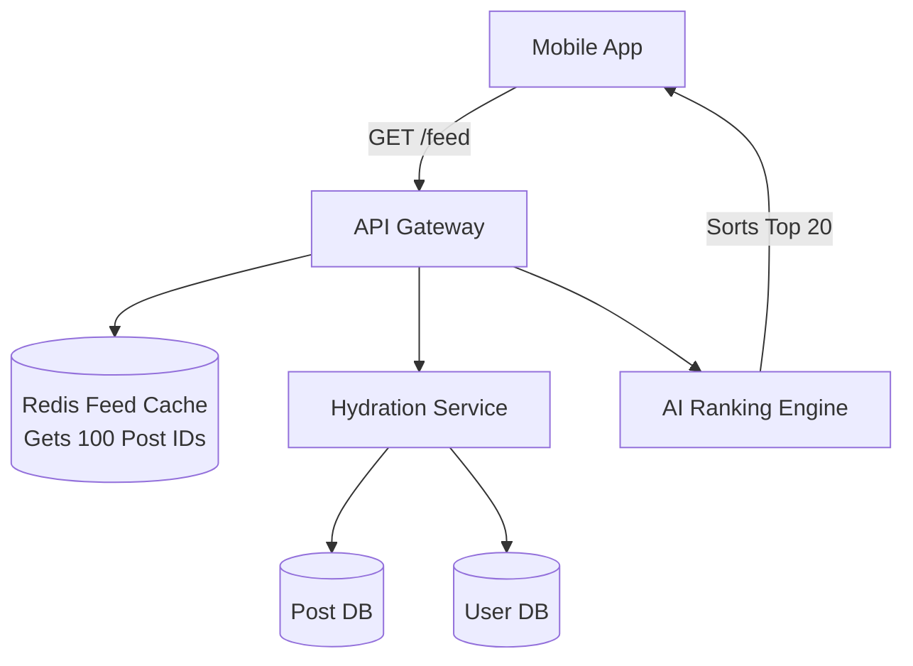

## Concept

**The Problem:** Design the Facebook News Feed. A user has 500 friends and follows 100 pages. When they open the app, they must instantly see a ranked, chronological timeline of posts, photos, and videos from their network.

*Note: This is very similar to the "Design Twitter" problem, but focuses more on complex ranking algorithms and diverse media types rather than pure chronological fan-out.*

## 1. Requirements

**Functional:**
- Users can publish posts (text, images, videos).
- Users can view a News Feed of posts from friends.
- The feed must be ranked by relevance, not just purely chronological.

**Non-Functional:**
- Generate the feed in under 200ms.
- High Availability (Degrade gracefully if specific services fail).

## 2. The Core Architecture: Push vs Pull

Like Twitter, we face the Fan-Out problem. Do we generate the feed when the user opens the app (Pull), or do we pre-compute it when friends post (Push)?

For Facebook, we use a **Hybrid Approach**, heavily leaning on Push.
1. Every active user has a **Feed Cache** (a Redis List or a Cassandra row containing a list of Post IDs).
2. When User B publishes a post, a background worker instantly pushes the `Post_ID` into the Feed Caches of all of their friends.
3. When User A opens the app, the server simply fetches the pre-computed list of Post IDs from Redis, fetches the actual post content from the database, and returns it.

## 3. The Feed Generation Pipeline (The Read Path)

Fetching the Post IDs from Redis is only step one. The News Feed is complex.

1. **Fetch IDs:** Get the top 100 Post IDs from User A's Redis Feed Cache.
2. **Hydration (GraphQL / BFF):** We only have IDs. We must "hydrate" them. The API Gateway sends requests to the `User Service` (to get the author's name/avatar), the `Post Service` (to get the text), and the `Media Service` (to get the image URLs).
3. **The Ranking Engine:** We don't just show them chronologically. We pass the 100 hydrated posts to an AI Ranking Service. It calculates a "Relevance Score" for every post. 
   - *Factors:* Does User A usually like User B's posts? Is this a video (which User A prefers)? Is the post trending?
4. **Sorting & Delivery:** The server sorts the 100 posts by their Relevance Score and returns the top 20 to the mobile app.

## 4. High-Level Diagram

## 5. Storage and Databases

A massive social network requires specialized databases for different data types.

- **User Data & Relationships (The Social Graph):** Who is friends with who? This is notoriously difficult in SQL. You use a **Graph Database** (like Neo4j or Amazon Neptune) to easily query complex relationships ("Find friends of friends who live in NY").
- **Post Content:** Billions of text posts. You use a NoSQL Wide-Column store like **Cassandra**.
- **Media (Images/Videos):** You never store images in a database. You store the raw files in **AWS S3** and store the S3 URL string inside Cassandra. The images are delivered to users via a **CDN** (Content Delivery Network).

## Interview Questions

**Q: User A opens their feed. The API Gateway tries to Hydrate the posts, but the `User Service` (which returns avatars and names) is currently down. Does the entire feed fail to load?**
**A:** No, this is where we implement **Graceful Degradation**. The API Gateway wraps the call to the User Service in a Circuit Breaker. When the User Service times out, the Circuit Breaker trips and instantly returns a fallback payload containing a generic grey silhouette avatar and the string "Facebook User". The News Feed still loads the text and images perfectly, allowing the user to continue scrolling without realizing the backend is partially broken.

**Q: Why do we only store `Post_ID` in the Redis Feed Cache, instead of storing the entire JSON blob of the post (Text, Image URL, Author Name)?**
**A:** Storing the full JSON blob is terrible for two reasons:
1. **Memory Exhaustion:** Redis stores data in RAM, which is incredibly expensive. Storing the full text of millions of posts in millions of users' caches would bankrupt the company.
2. **Data Consistency:** If User B edits their post to fix a typo, and you stored the full JSON in 500 different friends' Redis caches, you now have to write a massive distributed update script to find and update all 500 caches. By only storing the `Post_ID`, you only update the text *once* in the primary database. When the friends' feeds Hydrate the ID at read-time, they instantly get the updated text.
