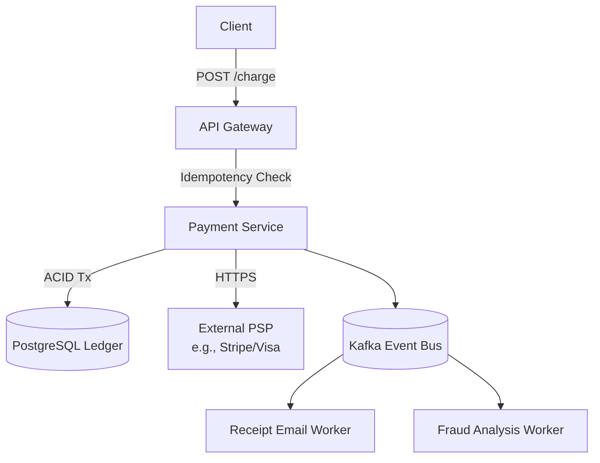

## Concept

**The Problem:** Design a payment gateway (like Stripe or PayPal) that can process credit cards, transfer balances, and guarantee absolute mathematical accuracy.

This question tests your knowledge of **ACID Transactions, Idempotency, and Event Sourcing**. 
In a social media app, dropping a "Like" is fine. In a payment system, dropping $100 is a lawsuit.

## 1. The Core Challenge: Exactly-Once Processing

In distributed systems, networks fail.
1. User clicks "Pay $100". The frontend sends a POST request.
2. The Server charges the credit card.
3. The Server sends the "HTTP 200 OK" response back.
4. *The network cable drops.* The user's browser never receives the 200 OK. It shows a timeout error.

The user thinks the payment failed, so they click "Pay $100" again. You just charged them $200.

### The Solution: Idempotency Keys
Every single payment request MUST include a unique `Idempotency-Key` (a UUID generated by the frontend).
1. The Server receives the request: `{"amount": 100, "idempotency_key": "abc-123"}`.
2. The Server executes an ACID database transaction:
   - Check if `abc-123` exists in the `payments` table.
   - If NO: Process the charge via Visa, save `abc-123` and `Status: SUCCESS` to the DB.
   - If YES: The server realizes this is a retry. It completely skips the Visa charge and simply returns the cached `SUCCESS` response from the database.

## 2. High-Level Architecture

## 3. The Ledger (Event Sourcing)

How do you store user balances?
You should **NEVER** just store a raw number in a database (`UPDATE users SET balance = 150`). If that row is corrupted or a bug alters it, you have no proof of how the user got $150.

You must use **Event Sourcing** (Double-Entry Bookkeeping).
You only store immutable append-only events (Ledger Entries).
- `Tx 1: +$100 (Deposit)`
- `Tx 2: -$20 (Coffee)`
- `Tx 3: -$30 (Book)`

To find the user's balance, you sum up all their historical ledger entries (Result: $50). This guarantees a mathematically perfect audit trail that can never be falsified. (For speed, you can maintain a cached `balance` column, but the Ledger table is the absolute source of truth).

## 4. Distributed Transactions (The Saga Pattern)

What if you are building Uber? The user pays $20, and you must add $20 to the Driver's balance. These two records might live in two entirely different microservices with different databases.
You cannot wrap them in a standard SQL Transaction because they don't share a database.

You must use the **Saga Pattern**.
1. The Payment Service successfully charges the Rider and saves `Rider -$20`.
2. It publishes an event to Kafka: `ChargeSuccessful`.
3. The Driver Service reads the event and adds `Driver +$20` to its database.
4. **Compensation:** What if the Driver Service crashes and the database explodes? The Driver Service publishes an error to Kafka. The Payment Service hears the error and executes a *Compensating Transaction* (a refund), adding `Rider +$20` back, ensuring both systems eventually reach a synchronized, zero-sum state.

## Interview Questions

**Q: A background worker pulls `ChargeSuccessful` events from Kafka to send email receipts. Due to a bug, the worker crashes after sending the email, but before committing the Kafka offset. It reboots and pulls the same message again. How do you prevent sending the user two emails?**
**A:** Message queues guarantee "At-Least-Once" delivery, so duplicates are inevitable. The consumer (the Email Worker) must be **Idempotent**. The Email Worker must maintain its own PostgreSQL database. Before sending an email for `Event_ID_456`, it tries to `INSERT INTO sent_emails (event_id) VALUES (456)`. If the database throws a Unique Constraint violation, the worker knows it already sent the email, and gracefully skips the operation.

**Q: Why do financial systems use PostgreSQL instead of highly-scalable NoSQL databases like MongoDB or Cassandra?**
**A:** Financial systems require strict **ACID compliance** (Atomicity, Consistency, Isolation, Durability). 
If money is moving between two accounts, the database must guarantee that both sides of the transaction succeed perfectly together, or both fail together (Atomicity). It must also lock the rows to prevent race conditions during concurrent reads/writes (Isolation). Relational databases like PostgreSQL are built from the ground up to enforce these strict mathematical guarantees, whereas NoSQL databases generally sacrifice these guarantees in favor of faster distributed scaling (Eventual Consistency), which is unacceptable for money.
