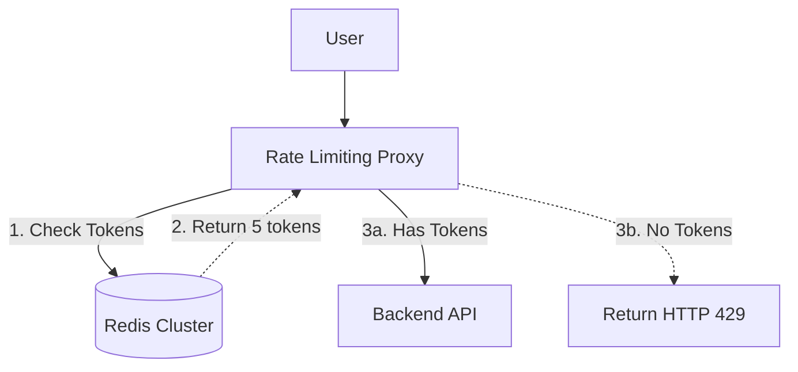

## Concept

**The Problem:** Design an API Rate Limiter that allows a user to make a maximum of 10 requests per second. If they exceed this, return an HTTP 429 Too Many Requests.

This question tests your understanding of specialized algorithms (Token Bucket, Sliding Window) and how to manage extreme read/write concurrency in Redis without race conditions.

## 1. Where does the Rate Limiter live?

It should **never** live inside your core application logic (Node.js/Python). If malicious traffic reaches your application code, the server is already wasting CPU parsing the request.
It must sit at the edge of the network.
1. **API Gateway:** Sit directly in the API Gateway (like Kong or AWS API Gateway).
2. **Middleware Proxy:** A dedicated reverse-proxy server that sits between the Load Balancer and the App Servers.

## 2. Choosing the Algorithm

*(Review the "Rate Limiting" chapter in the API Architecture section for deep dives on the algorithms).*

For interviews, the **Token Bucket** algorithm is the gold standard. It is easy to explain, memory efficient, and handles bursty traffic well.
- Every user has a "bucket" in Redis.
- Bucket holds max 10 tokens.
- We add 1 token every 100ms.
- A request costs 1 token.

## 3. High-Level Architecture (The Redis Problem)

The state (how many tokens a user has left) must be stored in a blazing-fast, centralized database. We use **Redis**.

## 4. The Core Challenge: The Race Condition

If you implement the Token Bucket using standard Redis commands, you will write code like this:
1. `GET user_123_tokens` (Returns 5)
2. `Check if > 0` (Yes)
3. `SET user_123_tokens 4`

**The Disaster:** If the user sends 10 concurrent requests at the exact same millisecond, 10 Node.js threads will execute step 1 simultaneously. They all read `5`. They all subtract 1 and run `SET 4`. 10 requests were allowed through, but the token count only dropped by 1. The rate limit is completely bypassed.

### The Solution: Redis Lua Scripts
You cannot use separate GET and SET commands. You must execute the logic atomically.
Redis allows you to upload **Lua Scripts**. A Lua script executes inside the Redis server. Redis is single-threaded, which means while the Lua script is executing the check-and-subtract math, all other incoming requests are perfectly queued up and blocked for a fraction of a millisecond. 
This provides 100% mathematical accuracy and eliminates the race condition entirely without needing complex database locks.

## 5. Scaling to Millions of Users

A single Redis node can handle ~100,000 operations per second. If your API serves 1 million requests per second globally, a single Redis server will crash.

**Sharding:**
You must deploy a Redis Cluster with dozens of nodes. You use Consistent Hashing to route traffic. `user_1`'s tokens are always stored on Redis Node A. `user_2` is on Node B.

**Multi-Region Synchronization:**
If you have data centers in New York and London, should they share one central Redis cluster?
No. Cross-Atlantic network latency is 100ms. If the Rate Limiter takes 100ms to check tokens, you just destroyed the performance of your API.
Each region must have its own isolated Redis cluster. `user_1` has 10 tokens in NY, and 10 tokens in London. This is technically a compromise (the user gets 20 global tokens), but for rate limiting, eventual consistency and slight over-provisioning are always preferred over adding 100ms of latency to every single API request.

## Interview Questions

**Q: A user exceeds their rate limit. What specific HTTP Headers should your Rate Limiter include in the HTTP 429 response?**
**A:** You must include diagnostic headers so the client's code knows how to react automatically:
- `X-Ratelimit-Remaining: 0`
- `X-Ratelimit-Limit: 10`
- `Retry-After: 5` (The most critical header. It tells the client's retry loop to sleep for exactly 5 seconds before attempting another request, preventing them from blindly hammering the server).

**Q: The Token Bucket algorithm is great, but it allows for sudden bursts. If a user hasn't made a request in an hour, their bucket is full (10 tokens). They can send all 10 requests in a single millisecond. How do you prevent this micro-burst if your backend is very fragile?**
**A:** You use the **Leaky Bucket** algorithm instead. 
The Leaky Bucket puts incoming requests into a FIFO queue. The queue "leaks" (processes) requests at a perfectly constant, unchangeable rate (e.g., exactly 1 request every 100ms). If a user sends 10 requests in one millisecond, they are placed in the queue, but they will be forwarded to the backend slowly and smoothly over the next 1 second. This guarantees absolute protection for fragile backend databases.
