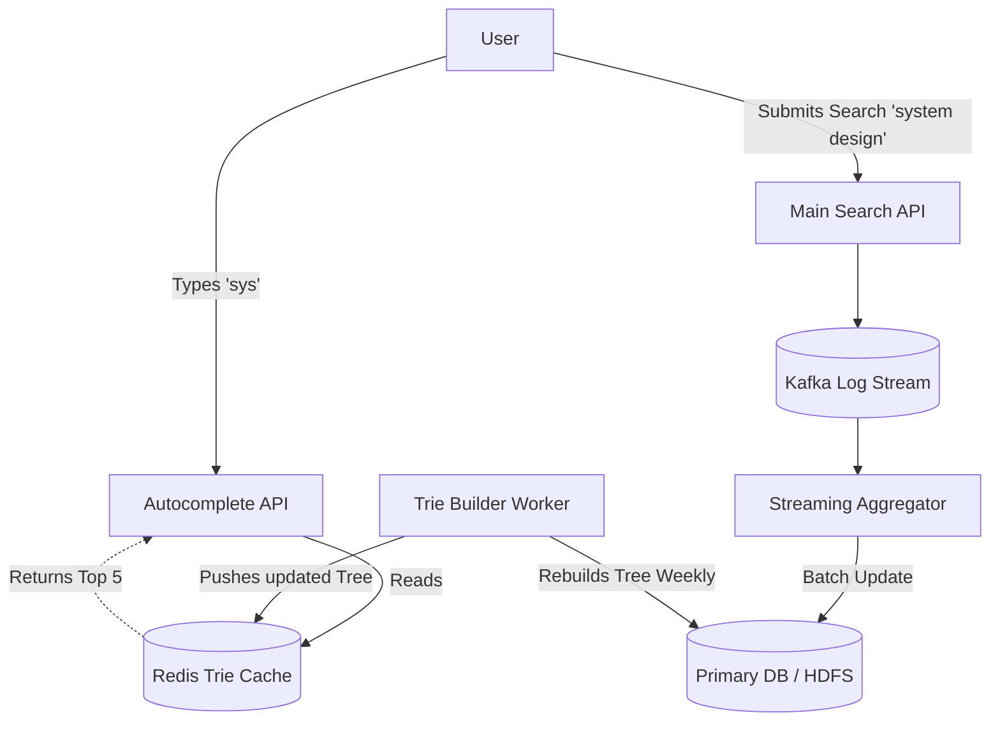

## Concept

**The Problem:** Design a system like Google's Search Autocomplete. As the user types `"sys"`, the system instantly suggests `"system design"`, `"system requirements"`, and `"system down"`. 

This question tests your knowledge of specialized, read-heavy data structures (specifically the **Trie**) and how to handle extreme real-time read/write volumes.

## 1. Requirements

**Functional:**
- Given a prefix, return the top 5 autocomplete suggestions.
- Suggestions must be ranked by popularity (search volume).

**Non-Functional:**
- **Extreme Low Latency:** Must return results in < 50ms. (The user is actively typing; if it takes 500ms, they've already finished typing the word).
- High Read Throughput (Every single keystroke generates an API call).

## 2. The Core Data Structure: The Trie

You cannot use a SQL database like `SELECT * FROM searches WHERE query LIKE 'sys%' ORDER BY count DESC LIMIT 5`. Scanning millions of strings on a hard drive will take seconds.

We must store the data in RAM using a **Trie (Prefix Tree)**.
A Trie is a tree where each node represents a single character.
- Root node is empty.
- Children: `s` -> `y` -> `s`.
- The node for `s` (the end of "sys") contains branches to `t` (system) and `a` (sysadmin).

**The Optimization:**
If the user types "sys", we traverse the tree to the `s` node. To find the top 5 suggestions, we technically have to traverse every single branch underneath `s`, find all complete words, and sort them by popularity score. This is too slow.
**The Fix:** We cache the Top 5 results *directly inside every single node*. The node for `s` physically contains a JSON array: `["system design", "system admin", ...]`. When the user types "sys", we do an $O(length)$ traversal to the `s` node, instantly read the array, and return it in 2 milliseconds.

## 3. High-Level Architecture

## 4. The Data Pipeline (Updating the Trie)

Google does not update the Trie in real-time. If you search for a completely new, unique word, it does not instantly appear in the autocomplete for everyone else globally. Updating a massive distributed Trie in RAM for every single search would destroy the servers.

**The Asynchronous Pipeline:**
1. When a user executes a search, the backend drops a log event into **Kafka**.
2. A streaming analytics engine (Apache Flink / Spark) aggregates the logs: *"The word 'system design' was searched 50,000 times this hour"*.
3. These aggregated counts are saved to a slow, permanent database.
4. Once a week (or once a day), a background **Trie Builder Worker** wakes up. It reads the massive database, mathematically builds a brand new, perfectly optimized Trie data structure in its own RAM, and serializes it.
5. The Worker pushes the brand new Trie to the Redis cache servers, replacing the old one entirely. 

## Interview Questions

**Q: A user on a slow 3G network types "s", then "y", then "s". Their phone fires 3 separate HTTP requests. Due to network routing weirdness, the response for "s" arrives at the phone *after* the response for "sys". The UI flashes backward and shows suggestions for "s", ruining the experience. How do you fix this?**
**A:** This is a classic frontend race condition called "Out of Order Execution". 
The frontend must use a concept called **Request Cancellation** (e.g., using `AbortController` in Javascript) or **Sequence Hashing**. 
When the user types the letter "y", the Javascript instantly aborts the pending HTTP network request for the "s" query before it fires the new one. Alternatively, the Javascript ignores any incoming HTTP responses that don't exactly match the string currently sitting in the text input box.

**Q: Firing an HTTP API request for every single keystroke will overwhelm our API Gateway with billions of requests. How can we optimize the client to reduce server load?**
**A:** We use **Debouncing** and **Client-Side Caching**.
1. **Debouncing:** The Javascript does not fire the API request instantly on `keyup`. It waits 50 milliseconds. If the user types the next letter within that 50ms window, the timer resets. The API call only fires when the user's fingers actually pause.
2. **Client-Side Caching:** The browser uses `sessionStorage` or local variables to cache results. If the user types "sys" (we fetch and cache results), hits Backspace to "sy", and types "s" again to return to "sys", the Javascript intercepts the request and instantly renders the cached results from memory without ever hitting the network.
